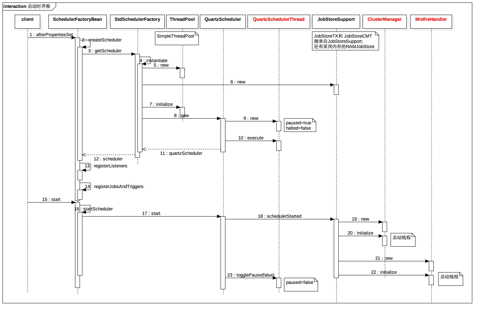

+ quartz 的核心元素
  + Scheduler:任务调度器，是实际执行任务调度的控制器。在spring中通过SchedulerFactoryBean封装起来。
  + Trigger：触发器，用于定义任务调度的时间规则，有SimpleTrigger,CronTrigger,DateIntervalTrigger和NthIncludedDayTrigger，其中CronTrigger用的比较多。
  + Calendar:它是一些日历特定时间点的集合。一个trigger可以包含多个Calendar，以便排除或包含某些时间点。
  + JobDetail:用来描述Job实现类及其它相关的静态信息，如Job名字、关联监听器等信息。在spring中有JobDetailFactoryBean和 MethodInvokingJobDetailFactoryBean两种实现，如果任务调度只需要执行某个类的某个方法，就可以通过MethodInvokingJobDetailFactoryBean来调用。
  + Job：是一个接口，只有一个方法void execute(JobExecutionContext context),开发者实现该接口定义运行任务。
  + JobExecutionContext类提供了调度上下文的各种信息。Job运行时的信息保存在JobDataMap实例中。实现Job接口的任务，默认是无状态的，若要将Job设置成有状态的，在quartz中是给实现的Job添加@DisallowConcurrentExecution注解,在与spring结合中可以在spring配置文件的job detail中配置concurrent参数。
  
+ Quartz 集群
  + Quartz 中有两种存储方式：RAMJobStore, JobStoreSupport。 
  + 其中 RAMJobStore 是将 trigger 和 job 存储在内存中，而 JobStoreSupport 是基于 jdbc 将 trigger 和 job 存储到数据库中。

|表|说明|
| :-----| :----: |
|QRTZ_FIRED_TRIGGERS|存储与已触发的Trigger相关的状态信息，以及相联Job的执行信息|
|QRTZ_PAUSED_TRIGGER_GRPS|存储已暂停的Trigger组的信息 |
|QRTZ_SCHEDULER_STATE|存储少量的有关Scheduler的状态信息，和别的Scheduler实例|
|QRTZ_LOCKS|存储程序的悲观锁的信息|
|QRTZ_SIMPLE_TRIGGERS|存储简单的Trigger，包括重复次数、间隔、以及已触的次数|
|QRTZ_SIMPROP_TRIGGERS||
|QRTZ_CRON_TRIGGERS|存储CronTrigger，包括Cron表达式和时区信息|
|QRTZ_BLOB_TRIGGERS|Trigger作为Blob类型存储|
|QRTZ_TRIGGERS|存储已配置的Trigger的信息|
|QRTZ_JOB_DETAILS|存储每一个已配置的Job的详细信息|
|QRTZ_CALENDARS| 存储Quartz的Calendar信息|

+ 整个启动流程

