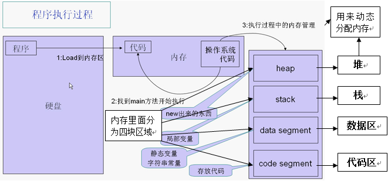
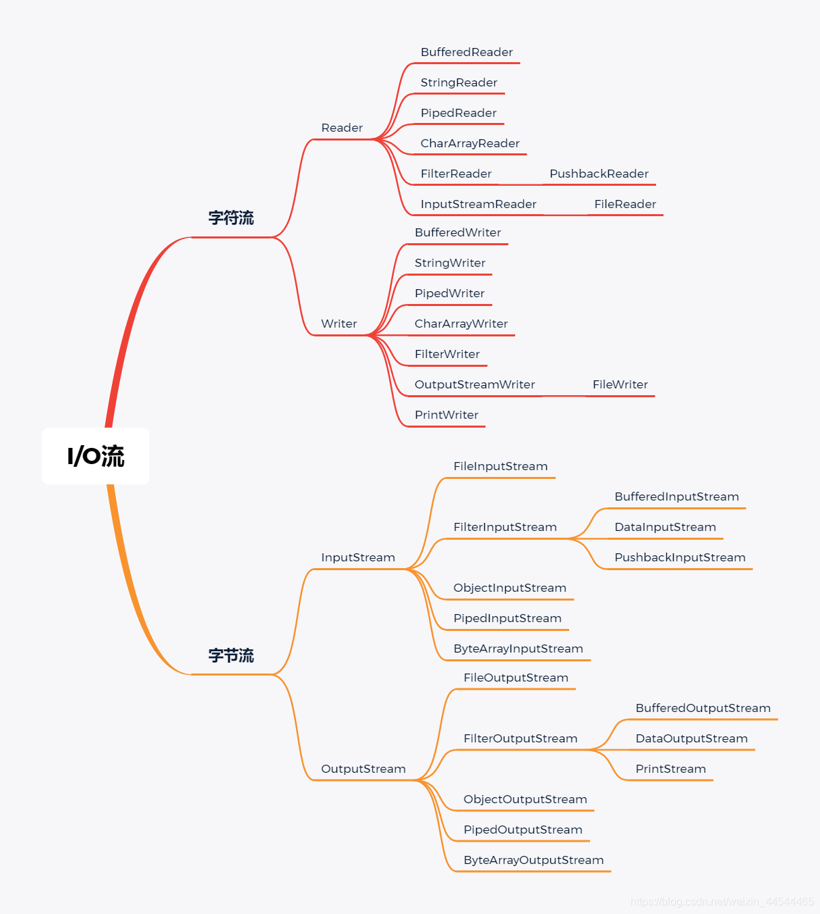
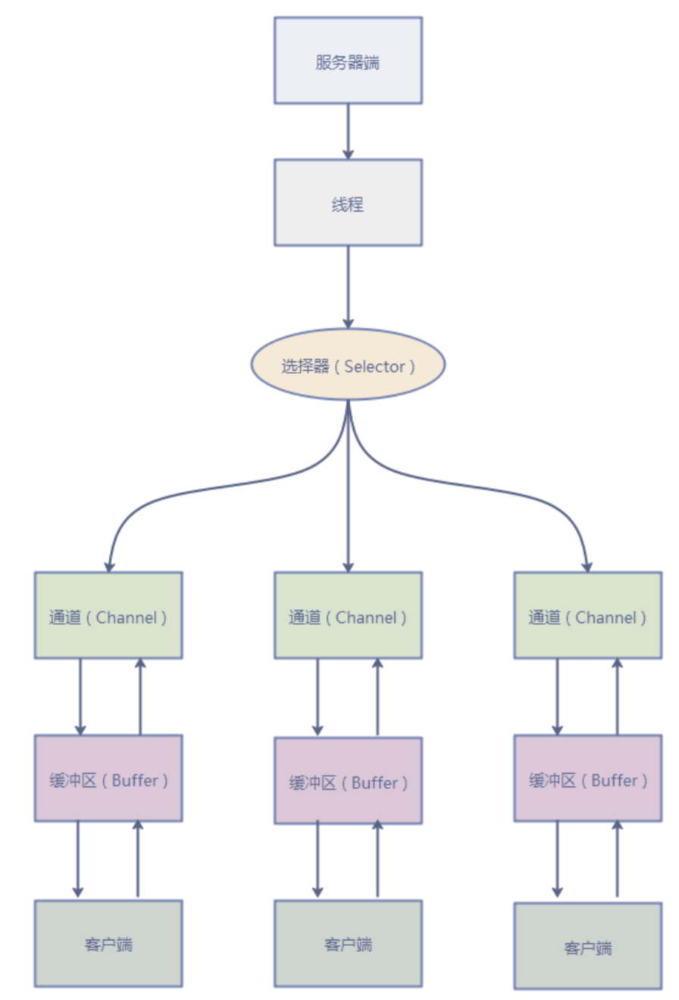

## 安装JDK
+ JAVA_HOME
+ PATH
+ CLASSPATH

## windows 和 linux 安装

## 基础语法
+ 标识符
+ 关键字
+ 数据类型
  + 变量
    + 　从本质上来讲，变量其实是内存里面的一小块区域，一个程序在运行的时候，实际上这个程序是位于内存里面，然后才开始运行。一个.exe文件存放在硬盘上是无法运行的，在硬盘上看到的.exe文件无非就是一个文件而已，当我们双击这个.exe文件时，运行起来的时候实际上是整个.exe文件被放在了在内存里面，然后操作系统找到main方法，也就是程序的入口，然后就开始执行了。执行的过程之中，会不断地在内存里面分配一些区域，变量在内存里面就是一小块区域，变量有两个概念，一个是变量的名字，另一个是变量的值，即这一小块区域是有名字的，里面装着一个值，因此以后要想访问这小块区域里面的内容就可以根据这小块区域的名字来访问了。因此，变量的本质就是一小块内存区域。就变量来说，该在内存里面分配多大的存储空间呢？不同的变量类型分配不同大小的存储空间，每一个变量都是属于特定的数据类型的，声明成不同的数据类型，它就在内存里面分配不同的存储空间。
  + 局部变量和成员变量
  + 基本数据类型
    + 数值型 int float double 
    + 字符型 char 
    + 布尔型 boolean
  + 引用数据类型
    + 类
    + 接口
    + 数组
+ 运算符
  + 算术运算符
  + 关系运算符
  + 逻辑运算符
  + 位运算符
  + 赋值运算符
  + 三目运算符
+ 语句
  + if语句
  + switch 语句
  + for语句
  + while语句
  + do-while语句
+ 方法
+ 程序执行过程
  

## I/O
+ 数据流是指所有的数据通信通道
+ 
+ 字符流， 单位是 byte
+ 字节流

### File类
+ File 可以表示文件也可以表示目录，File 类控制所有硬盘操作

| 分类     | 字节输入流                 | 字节输出流                  | 字符输入流            | 字符输出流            |
|--------|-----------------------|------------------------|------------------|------------------|
| 抽象基类   | InputStream           | OutputStream           | Reader           | Writer           |
| 访问文件   | 	FileInputStream      | 	FileOutputStream      | 	FileReader      | 	FileWriter      |
| 访问数组   | 	ByteArrayInputStream | 	ByteArrayOutputStream | 	CharArrayReader | 	CharArrayWriter |
| 访问管道   | 	PipedInputStream     | 	PipedOutputStream     | 	PipedReader     | 	PipedWriter     |
| 访问字符串  | 	                     |                        | 	 	StringReader  | 	StringWriter    |
| 缓冲流    | 	BufferedInputStream  | 	BufferedOutputStream  | 	BufferedReader  | 	BufferedWriter  |
| 转换流	   | 	 	InputStreamReader	 | OutputStreamWriter     |                  |                  |
| 对象流	   | ObjectInputStream     | 	ObjectOutputStream	   |||	 
| 抽象基类	  | FilterInputStream     | 	FilterOutputStream	   | FilterReader     | 	FilterWriter    |
| 打印流	   |                       | 	PrintStream	          |                  | 	PrintWriter     |
| 推回输入流	 | PushbackInputStream	  |                        | 	PushbackReader	 |                  |
| 特殊流	   | DataInputStream       | 	DataOutputStream      |||

### NIO

## 面向对象

## 反射
+ 通过java语言中的反射机制可以操作字节码文件（可以读和修改字节码文件。）
+ 通过反射机制可以操作代码片段。（class文件。）

+ 重要的类

| 类                             | 	含义                                 | 
|-------------------------------|-------------------------------------|
| java.lang.Class               | 	代表整个字节码。代表一个类型，代表整个类。              | 
| java.lang.reflect.Method      | 	代表字节码中的方法字节码。代表类中的方法。              | 
| java.lang.reflect.Constructor | 	代表字节码中的构造方法字节码。代表类中的构造方法。          | 
| java.lang.reflect.Field       | 	代表字节码中的属性字节码。代表类中的成员变量（静态变量+实例变量）。 | 

+ 获取Class的三方式

|方式 |	备注 |
|  ----  | ----  |
|Class.forName(“完整类名带包名”) |	静态方法 |
|对象.getClass() |
|任何类型.class	 |

### Class类

### Field类

### Method类