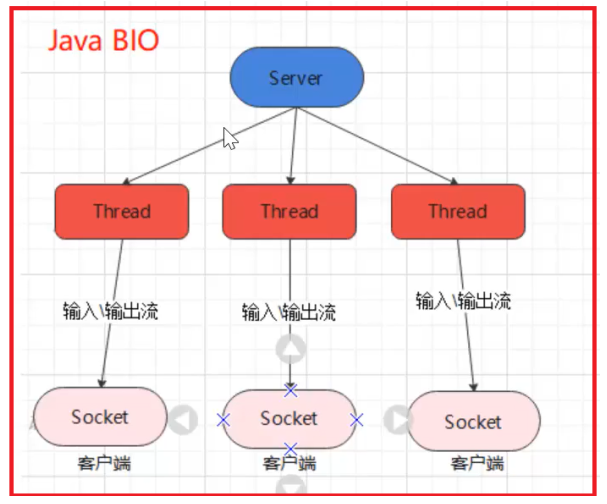
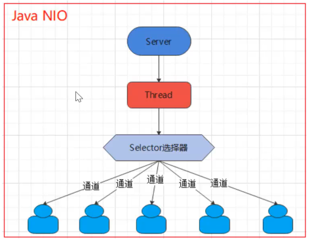

Java BIO

同步并阻塞（传统阻塞型），服务器实现模式为一个连接一个线程，即客户端有连接请求时服务器 端就需要启动一个线程进行处理，如果这个连接不做任何事情会造成不必要的线程开销【简单示意图 】

java NIO

Java NIO：同步非阻塞，服务器实现模式为一个线程处理多个请求（连接），即客户端发送的连接请求都会注 册到多路复用器上，多路复用器轮询到连接有I/O请求就进行处理【简单示意图】

java AIO

java AIO(NIO.2)：异步异步非阻塞，服务器实现模式为一个有效请求一个线程，客户端的I/O请求都是由OS先完 成了再通知服务器应用去启动线程进行处理，一般适用于连接数较多且连接时间较长的应用

