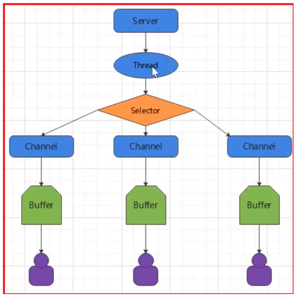

## Java BIO

同步并阻塞（传统阻塞型），服务器实现模式为一个连接一个线程，即客户端有连接请求时服务器 端就需要启动一个线程进行处理，如果这个连接不做任何事情会造成不必要的线程开销【简单示意图 】

## java NIO

Java NIO：同步非阻塞，服务器实现模式为一个线程处理多个请求（连接），即客户端发送的连接请求都会注 册到多路复用器上，多路复用器轮询到连接有I/O请求就进行处理【简单示意图】

+ NIO有三大核心部分：Channel(通道)，Buffer(缓存区)，Selector(选择器)

Buffer缓存区
缓冲区本质上是一块可以写入数据，然后可以从中读取数据的内存。这块内存被包装成NIO Buffer对象，并提供了 一组方法，用来方便的访问该块内存。相比较直接对数组的操作，Buffer API更加容易操作和管理。

+ Channel通道 
  + Java NIO的通道类似流，但又有些不同：既可以从通道中读取数据，又可以写数据到通道。但流的(input或 output)读写通常是单向的。通道可以非阻塞读取和写入通道，通道可以支持读取或写入缓冲区，也支持异步地读写。

+ 常用的Channel实现类 
  + FileChannel：用于读取、写入、映射和操作文件的通道 
  + DatagramChannel：通过UDP读写网络中的数据通道 
  + SocketChannel：通过TCP读写网络中额数据 
  + ServerSocketChannel：可以监听新进来的TCP连接，对每一个新进来的连接都会创建一个SocketChannel。 
    + 【ServerSocketChannel类似ServerSocket，SocketChannel类似Socket】

Selector选择器
Selector是一个ava NIO组件，可以能够检查一个或多个NIO通道，并确定哪些通道已经准备好进行读取或写 入。这样，一个单独的线程可以管理多个channel，从而管理多个网络连接，提高效率

## java AIO

java AIO(NIO.2)：异步异步非阻塞，服务器实现模式为一个有效请求一个线程，客户端的I/O请求都是由OS先完 成了再通知服务器应用去启动线程进行处理，一般适用于连接数较多且连接时间较长的应用

