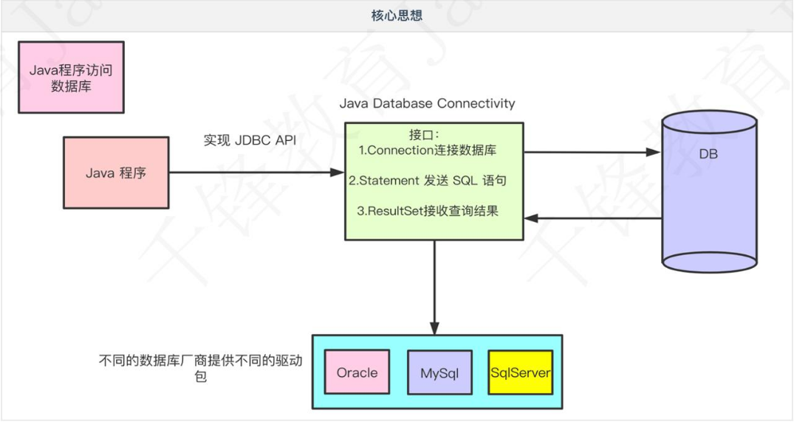
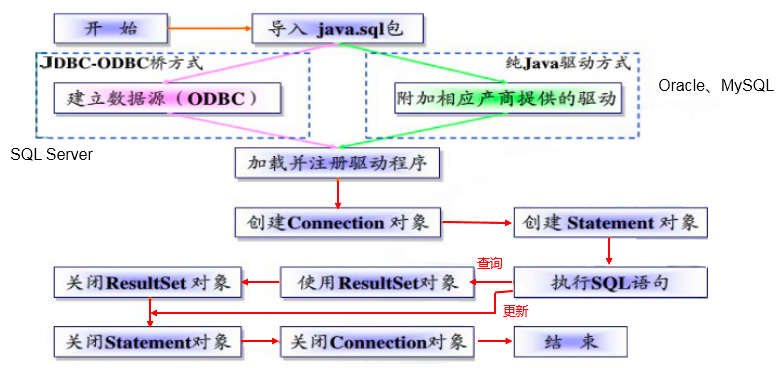
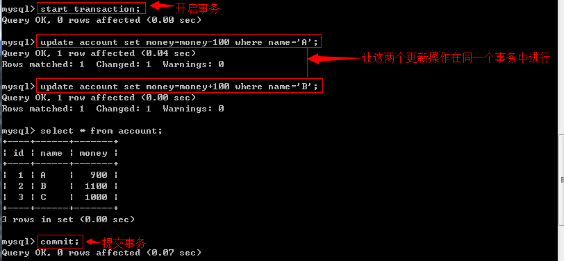
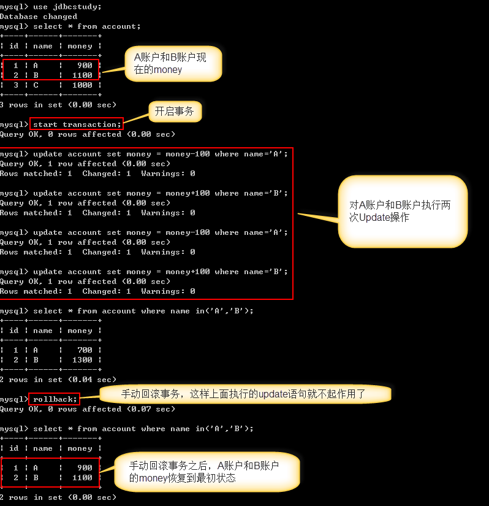
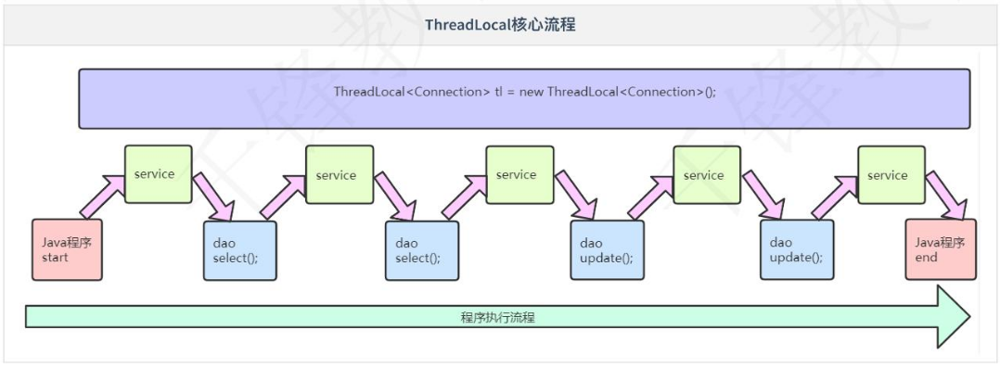

# JDBC
## JDBC(Java Database Connectivity)
## 核心思想


## 开发步骤
+ 注册驱动
+ 连接数据库
+ 获取发送SQL的对象
+ 执行SQL语句
+ 处理结果
+ 释放资源


### JDBC程序编写步骤



## 几个对象
+ DriverManager
```
Jdbc程序中的DriverManager用于加载驱动，并创建与数据库的链接，这个API的常用方法：

DriverManager.registerDriver(new Driver())
DriverManager.getConnection(url, user, password)，
　　注意：在实际开发中并不推荐采用registerDriver方法注册驱动。原因有二：
　　　　1、查看Driver的源代码可以看到，如果采用此种方式，会导致驱动程序注册两次，也就是在内存中会有两个Driver对象。
　　　　2、程序依赖mysql的api，脱离mysql的jar包，程序将无法编译，将来程序切换底层数据库将会非常麻烦。

　　推荐方式：Class.forName("com.mysql.jdbc.Driver");
　　采用此种方式不会导致驱动对象在内存中重复出现，并且采用此种方式，程序仅仅只需要一个字符串，不需要依赖具体的驱动，使程序的灵活性更高。
```

+ 数据库URL讲解
```
URL的写法为： 协议:子协议://ip:port/db_name

常用数据库URL地址的写法：
Oracle写法：   jdbc:oracle:thin:@localhost:1521:sid
SqlServer写法：jdbc:microsoft:sqlserver://localhost:1433; DatabaseName=sid
MySql写法：    jdbc:mysql://localhost:3306/sid
```
+ Connection
```
Jdbc程序中的Connection，它用于代表数据库的链接，Collection是数据库编程中最重要的一个对象，客户端与数据库所有交互都是通过connection对象完成的，这个对象的常用方法：

createStatement()：创建向数据库发送sql的statement对象。
prepareStatement(sql) ：创建向数据库发送预编译sql的PrepareSatement对象。
prepareCall(sql)：创建执行存储过程的callableStatement对象。
setAutoCommit(boolean autoCommit)：设置事务是否自动提交。
commit() ：在链接上提交事务。
rollback() ：在此链接上回滚事务。
```
+ Statement
```
Jdbc程序中的Statement对象用于向数据库发送SQL语句， Statement对象常用方法：

executeQuery(String sql) ：用于向数据发送查询语句。
executeUpdate(String sql)：用于向数据库发送insert、update或delete语句
execute(String sql)：用于向数据库发送任意sql语句
addBatch(String sql) ：把多条sql语句放到一个批处理中。
executeBatch()：向数据库发送一批sql语句执行。
```
+ ResultSet
```
　　Jdbc程序中的ResultSet用于代表Sql语句的执行结果。Resultset封装执行结果时，采用的类似于表格的方式。ResultSet 对象维护了一个指向表格数据行的游标，初始的时候，游标在第一行之前，调用ResultSet.next() 方法，可以使游标指向具体的数据行，进行调用方法获取该行的数据。
　　ResultSet既然用于封装执行结果的，所以该对象提供的都是用于获取数据的get方法：
　　获取任意类型的数据
　　　　getObject(int index)
　　　　getObject(string columnName)
　　获取指定类型的数据，例如：
　　　　getString(int index)
　　　　getString(String columnName)

　　ResultSet还提供了对结果集进行滚动的方法：

next()：移动到下一行
Previous()：移动到前一行
absolute(int row)：移动到指定行
beforeFirst()：移动resultSet的最前面。
afterLast() ：移动到resultSet的最后面。
```
+ 释放资源
```
Jdbc程序运行完后，切记要释放程序在运行过程中，创建的那些与数据库进行交互的对象，这些对象通常是ResultSet, Statement和Connection对象，特别是Connection对象，它是非常稀有的资源，用完后必须马上释放，如果Connection不能及时、正确的关闭，极易导致系统宕机。
Connection的使用原则是尽量晚创建，尽量早的释放。为确保资源释放代码能运行，资源释放代码也一定要放在finally语句中。
```

##  CRUD
+ statement
```
Jdbc中的statement对象用于向数据库发送SQL语句，想完成对数据库的增删改查，只需要通过这个对象向数据库发送增删改查语句即可。
Statement对象的executeUpdate方法，用于向数据库发送增、删、改的sql语句，executeUpdate执行完后，将会返回一个整数(即增删改语句导致了数据库几行数据发生了变化)。
Statement.executeQuery方法用于向数据库发送查询语句，executeQuery方法返回代表查询结果的ResultSet对象。
```

## 大数据
```
大数据也称之为LOB(Large Objects)，LOB又分为：clob和blob，clob用于存储大文本，blob用于存储二进制数据，例如图像、声音、二进制文等。

在实际开发中，有时是需要用程序把大文本或二进制数据直接保存到数据库中进行储存的。

对MySQL而言只有blob，而没有clob，mysql存储大文本采用的是Text，Text和blob分别又分为：
TINYTEXT、TEXT、MEDIUMTEXT和LONGTEXT
TINYBLOB、BLOB、MEDIUMBLOB和LONGBLOB
```

## 批处理
```
1、使用Statement对象添加要批量执行SQL语句，如下：
    1 Statement.addBatch(sql1);
    2 Statement.addBatch(sql2);
    3 Statement.addBatch(sql3);
2、执行批处理SQL语句：Statement.executeBatch();
3、清除批处理命令：Statement.clearBatch();

　采用Statement.addBatch(sql)方式实现批处理：
　　　　优点：可以向数据库发送多条不同的ＳＱＬ语句。
　　　　缺点：SQL语句没有预编译。

　采用PreparedStatement.addBatch()实现批处理
　　　　优点：发送的是预编译后的SQL语句，执行效率高。
　　　　缺点：只能应用在SQL语句相同，但参数不同的批处理中。因此此种形式的批处理经常用于在同一个表中批量插入数据，或批量更新表的数据。
```

## 事务
+ 事务指逻辑上的一组操作，组成这组操作的各个单元，要不全部成功，要不全部不成功。
```
/*创建账户表*/
create table account(
    id int primary key auto_increment,
    name varchar(40),
    money float
);

/*插入测试数据*/
insert into account(name,money) values('A',1000);
insert into account(name,money) values('B',1000);
insert into account(name,money) values('C',1000);

```
    + 开启事务(start transaction)
    + 提交事务(commit)

    + 回滚事务(rollback)


+ JDBC中操作
```
当Jdbc程序向数据库获得一个Connection对象时，默认情况下这个Connection对象会自动向数据库提交在它上面发送的SQL语句。
若想关闭这种默认提交方式，让多条SQL在一个事务中执行，可使用下列的JDBC控制事务语句
Connection.setAutoCommit(false);//开启事务(start transaction)
Connection.rollback();//回滚事务(rollback)
Connection.commit();//提交事务(commit)
```

+ 事务的四大特性(ACID)
```
原子性（Atomicity）
　　原子性是指事务是一个不可分割的工作单位，事务中的操作要么全部成功，要么全部失败。比如在同一个事务中的SQL语句，要么全部执行成功，要么全部执行失败

一致性（Consistency）
　　官网上事务一致性的概念是：事务必须使数据库从一个一致性状态变换到另外一个一致性状态。以转账为例子，A向B转账，假设转账之前这两个用户的钱加起来总共是2000，那么A向B转账之后，不管这两个账户怎么转，A用户的钱和B用户的钱加起来的总额还是2000，这个就是事务的一致性。

隔离性（Isolation）
　　事务的隔离性是多个用户并发访问数据库时，数据库为每一个用户开启的事务，不能被其他事务的操作数据所干扰，多个并发事务之间要相互隔离。

持久性（Durability）
    持久性是指一个事务一旦被提交，它对数据库中数据的改变就是永久性的，接下来即使数据库发生故障也不应该对其有任何影响

　　事务的四大特性中最麻烦的是隔离性，下面重点介绍一下事务的隔离级别
```

+ 事务的隔离级别
```
　　多个线程开启各自事务操作数据库中数据时，数据库系统要负责隔离操作，以保证各个线程在获取数据时的准确性。

5.1、事务不考虑隔离性可能会引发的问题　　
　　如果事务不考虑隔离性，可能会引发如下问题：

　　1、脏读
　　　　　脏读指一个事务读取了另外一个事务未提交的数据。

　　　　　这是非常危险的，假设Ａ向Ｂ转帐100元，对应sql语句如下所示
    　　　　　　1.update account set money=money+100 where name='B';    
    　　　　　　2.update account set money=money-100  where name='A';
    　　　 当第1条sql执行完，第2条还没执行(A未提交时)，如果此时Ｂ查询自己的帐户，就会发现自己多了100元钱。如果A等B走后再回滚，B就会损失100元。　　

　　2、不可重复读
　　不可重复读指在一个事务内读取表中的某一行数据，多次读取结果不同。
　　例如银行想查询A帐户余额，第一次查询A帐户为200元，此时A向帐户内存了100元并提交了，银行接着又进行了一次查询，此时A帐户为300元了。银行两次查询不一致，可能就会很困惑，不知道哪次查询是准的。
　　不可重复读和脏读的区别是，脏读是读取前一事务未提交的脏数据，不可重复读是重新读取了前一事务已提交的数据。
　　很多人认为这种情况就对了，无须困惑，当然是后面的为准。我们可以考虑这样一种情况，比如银行程序需要将查询结果分别输出到电脑屏幕和写到文件中，结果在一个事务中针对输出的目的地，进行的两次查询不一致，导致文件和屏幕中的结果不一致，银行工作人员就不知道以哪个为准了。

　　3、虚读(幻读)
　　虚读(幻读)是指在一个事务内读取到了别的事务插入的数据，导致前后读取不一致。
　　如丙存款100元未提交，这时银行做报表统计account表中所有用户的总额为500元，然后丙提交了，这时银行再统计发现帐户为600元了，造成虚读同样会使银行不知所措，到底以哪个为准。

5.2、事务隔离性的设置语句
　　MySQL数据库共定义了四种隔离级别：

Serializable(串行化)：可避免脏读、不可重复读、虚读情况的发生。
Repeatable read(可重复读)：可避免脏读、不可重复读情况的发生。
Read committed(读已提交)：可避免脏读情况发生。
Read uncommitted(读未提交)：最低级别，以上情况均无法保证。
　　mysql数据库查询当前事务隔离级别：select @@tx_isolation

　　例如：

　　

　　mysql数据库默认的事务隔离级别是：Repeatable read(可重复读)

　　mysql数据库设置事务隔离级别：set transaction isolation level 隔离级别名

　　例如：

　　

5.3、使用MySQL数据库演示不同隔离级别下的并发问题
　　同时打开两个窗口模拟2个用户并发访问数据库

1、当把事务的隔离级别设置为read uncommitted时，会引发脏读、不可重复读和虚读
　　A窗口
　　　　set transaction isolation level  read uncommitted;--设置A用户的数据库隔离级别为Read uncommitted(读未提交)
　　　　start transaction;--开启事务
　　　　select * from account;--查询A账户中现有的钱，转到B窗口进行操作
　　　　select * from account--发现a多了100元，这时候A读到了B未提交的数据（脏读）

　　B窗口
　　　　start transaction;--开启事务
　　　　update account set money=money+100 where name='A';--不要提交，转到A窗口查询

2、当把事务的隔离级别设置为read committed时，会引发不可重复读和虚读，但避免了脏读
　　A窗口
　　　　set transaction isolation level  read committed;
　　　　start transaction;
　　　　select * from account;--发现a帐户是1000元，转到b窗口
　　　　select * from account;--发现a帐户多了100,这时候，a读到了别的事务提交的数据，两次读取a帐户读到的是不同的结果（不可重复读）
　　B窗口
　　　　start transaction;
　　　　update account set money=money+100 where name='aaa';
　　　　commit;--转到a窗口

3、当把事务的隔离级别设置为repeatable read(mysql默认级别)时，会引发虚读，但避免了脏读、不可重复读
　　A窗口
　　　　set transaction isolation level repeatable read;
　　　　start transaction;
　　　　select * from account;--发现表有4个记录，转到b窗口
　　　　select * from account;--可能发现表有5条记录，这时候发生了a读取到另外一个事务插入的数据（虚读）
　　B窗口
　　　　start transaction;
　　　　insert into account(name,money) values('ggg',1000);
　　　　commit;--转到a窗口

4、当把事务的隔离级别设置为Serializable时，会避免所有问题
　　A窗口
　　　　set transaction isolation level Serializable;
　　　　start transaction;
　　　　select * from account;--转到b窗口

　　B窗口
　　　　start transaction;
　　　　insert into account(name,money) values('ggg',1000);--发现不能插入，只能等待a结束事务才能插入


```

+ ThreadLocal
    + 一个线程共享同一个ThreadLocal，在整个流程中任一环节可以存值或取值


开源数据库连接池

## 连接池
+ 开源数据库连接池
    + DBCP 数据库连接池
    + C3P0 数据库连接池
```
DBCP数据源
　　DBCP 是 Apache 软件基金组织下的开源连接池实现，要使用DBCP数据源，需要应用程序应在系统中增加如下两个 jar 文件：

Commons-dbcp.jar：连接池的实现
Commons-pool.jar：连接池实现的依赖库
　　Tomcat 的连接池正是采用该连接池来实现的。该数据库连接池既可以与应用服务器整合使用，也可由应用程序独立使用。
```

```
C3P0数据源
　　C3P0是一个开源的JDBC连接池，它实现了数据源和JNDI绑定，支持JDBC3规范和JDBC2的标准扩展。目前使用它的开源项目有Hibernate，Spring等。C3P0数据源在项目开发中使用得比较多。

　　c3p0与dbcp区别
dbcp没有自动回收空闲连接的功能
c3p0有自动回收空闲连接功能
```

## Druid 连接池

## Apache的DbUtils