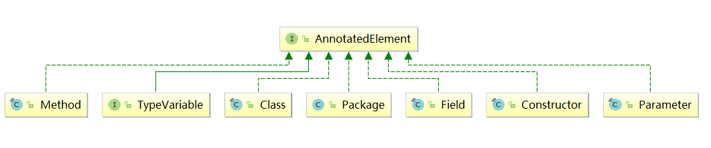

_### 注解
+ 什么是注解
  + @Override

+ 注解如何使用？
+ 3个步骤： 
+ 定义注解 
  + 如何为注解定义参数？ 
```text
  public @interface MyAnnotation {
  }
    
  // 注解中定义参数
  public @interface 注解名称{
  [public] 参数类型 参数名称1() [default 参数默认值];
  [public] 参数类型 参数名称2() [default 参数默认值];
  [public] 参数类型 参数名称n() [default 参数默认值]; }
   ```
  + 说明 
    + 访问修饰符必须为public，不写默认为public 
    + 该元素的类型只能是基本数据类型、String、Class、枚举类型、注解类型 以及上述类型的一位数组 
    + 该元素的名称一般定义为名词，如果注解中只有一个元素，请把名字起为value
    + 参数名称后面的()不是定义方法参数的地方，也不能在括号中定义任何参数，仅仅只是一个特殊的语法 
    + default代表默认值，值必须和第2点定义的类型一致 
    + 如果没有默认值，代表后续使用注解时必须给该类型元素赋值

    + 指定注解的使用范围：@Target   
    + 指定注解的保留策略：@Retention

  + 使用注解
    + 使用
```text
@注解名称(参数1=值1,参数2=值2,参数n=值n)
目标对象
```
 + UseAnno01 ～ UseAnno06


+ 注解信息的获取
  + 为了运行时能准确获取到注解的相关信息，Java在java.lang.reflect 反射包下新增了AnnotatedElement接口，它主要用于表示目前正在虚拟机中运行的程序中已使用注解的元素，通过该接口提供的方法可以利用反射技术地读取注解的信息



+ Package：用来表示包的信息 
+ Class：用来表示类的信息 
+ Constructor：用来表示构造方法信息 
+ Field：用来表示类中属性信息 
+ Method：用来表示方法信息 
+ Parameter：用来表示方法参数信息 
+ TypeVariable：用来表示类型变量信息，如：类上定义的泛型类型变量，方法上面定义的泛型类型变量

+ AnnotatedElement常用方法

|返回值|方法名称|说明
|---|---|---
|<A extends Annotation>|getAnnotation(Class<A> annotationClass)|该元素如果存在指定类型的注解，则返回这些注解，否则返回 null。
|Annotation[]|getAnnotations()|返回此元素上存在的所有注解，包括从父类继承的
|boolean|isAnnotationPresent(Class<? extends Annotation> annotationClass)|如果指定类型的注解存在于此元素上，则返回 true，否则返回 false。
|Annotation[]|getDeclaredAnnotations()|返回直接存在于此元素上的所有注解，注意，不包括父类的注解，调用者可以随意修改返回的数组；这不会对其他调用者返回的数组产生任何影响，没有则返回长度为0的数组
		
		
		
		
		