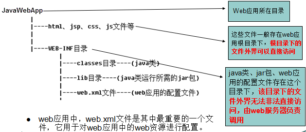

## C/S 和 B/S
```
静态web资源（如html 页面）：指web页面中供人们浏览的数据始终是不变。
动态web资源：指web页面中供人们浏览的数据是由程序产生的，不同时间点访问web页面看到的内容各不相同。
```


## Tomcat服务器

### tomcat 目录结构
+ web.s01_xml , server.s01_xml , context.s01_xml

### 虚拟目录的映射方式
+ 虚拟目录的映射方式一：在server.xml文件的host元素中配置
+ 虚拟目录的映射方式二：让tomcat服务器自动映射
+ 虚拟目录的映射方式三：conf下配置xml文件 
  
### 体系结构


```text
Tomcat服务器的启动是基于一个server.xml文件的，
Tomcat启动的时候首先会启动一个Server，Server里面就会启动Service，
Service里面就会启动多个"Connector(连接器)"，每一个连接器都在等待客户机的连接，
当有用户使用浏览器去访问服务器上面的web资源时，首先是连接到Connector(连接器)，Connector(连接器)是不处理用户的请求的，
而是将用户的请求交给一个Engine(引擎)去处理，Engine(引擎)接收到请求后就会解析用户想要访问的Host，
然后将请求交给相应的Host，Host收到请求后就会解析出用户想要访问这个Host下面的哪一个Web应用,
一个web应用对应一个Context。
```

### war包
+ 现在的项目就是基于springboot，打jar包
  
  
+ 部署在tomcat 中


+ 注意context path 和 部署目录
 
## HTTP协议
+设置不同的请求头

## Servlet概念

+ 用户若想用发一个动态web资源，需要完成以下2个步骤：
  + 1、编写一个Java类，实现servlet接口。
  + 2、把开发好的Java类部署到web服务器中。

+ 运行过程 
  + ①Web服务器首先检查是否已经装载并创建了该Servlet的实例对象。如果是，则直接执行第④步，否则，执行第②步。
  + ②装载并创建该Servlet的一个实例对象。
  + ③调用Servlet实例对象的init()方法。
  + ④创建一个用于封装HTTP请求消息的HttpServletRequest对象和一个代表HTTP响应消息的HttpServletResponse对象，然后调用Servlet的service()方法并将请求和响应对象作为参数传递进去。
  + ⑤WEB应用程序被停止或重新启动之前，Servlet引擎将卸载Servlet，并在卸载之前调用Servlet的destroy()方法。


### 示例
+ 包
+ 编写
+ 部署
+ 配置

### Servlet接口
```
在ServletAPI中最重要的是Servlet接口，所有Servlet都会直接或间接的与该接口发生联系，或是直接实现该接口，或间接继承自实现了该接口的类。
该接口包括以下五个方法：

init(ServletConfig com.hm.config)
ServletConfig getServletConfig()
com.hm.service(ServletRequest req,ServletResponse res)
String getServletInfo()
destroy()

处理方式：
（1）第一次访问Servlet时，服务器会创建Servlet对象，并调用init方法，再调用service方法
（2）第二次再访问时，Servlet对象已经存在，不再创建,也不再初始化，执行service方法
（3）当服务器停止，会释放Servlet，调用destroy方法。
```

### GenericServlet抽象类
```
GenericServlet 使编写 servlet 变得更容易。它提供生命周期方法 init 和 destroy 的简单实现，要编写一般的 servlet，只需重写抽象 com.hm.service 方法即可。 
```

### HttpServlet类
```
是继承GenericServlet的基础上进一步的扩展。
提供将要被子类化以创建适用于 Web 站点的 HTTP servlet 的抽象类。HttpServlet 的子类至少必须重写一个方法，该方法通常是以下这些方法之一： 
doGet，如果 servlet 支持 HTTP GET 请求 
doPost，用于 HTTP POST 请求 
doPut，用于 HTTP PUT 请求 
doDelete，用于 HTTP DELETE 请求 
init 和 destroy，用于管理 servlet 的生命周期内保存的 资源 
getServletInfo，servlet 使用它提供有关其自身的信息 
```

### 两种配置方式
+ web.s01_xml
  + URL映射配置
    + <servlet>元素用于注册Servlet，它包含有两个主要的子元素：<servlet-name>和<servlet-class>，分别用于设置Servlet的注册名称和Servlet的完整类名。
    + 一个<servlet-mapping>元素用于映射一个已注册的Servlet的一个对外访问路径，它包含有两个子元素：<servlet-name>和<url-pattern>，分别用于指定Servlet的注册名称和Servlet的对外访问路径
    + 同一个Servlet可以被映射到多个URL上，即多个<servlet-mapping>元素的<servlet-name>子元素的设置值可以是同一个Servlet的注册名

  + 使用*通配符映射
+ 注解

### 生命周期
```text
针对客户端的多次Servlet请求，通常情况下，服务器只会创建一个Servlet实例对象，也就是说Servlet实例对象一旦创建，它就会驻留在内存中，为后续的其它请求服务，直至web容器退出，servlet实例对象才会销毁。

在Servlet的整个生命周期内，Servlet的init方法只被调用一次。而对一个Servlet的每次访问请求都导致Servlservice方法。
对于每次访问请求，Servlet引擎都会创建一个新的HttpServletRequest请求对象和一个新的HttpServletResponse响应对象，
然后将这两个对象作为参数传递给它调用的Servlet的service()方法，service方法再根据请求方式分别调用doXXX方法。

线程安全问题只存在多个线程并发操作同一个资源的情况下，所以在编写Servlet的时候，如果并发访问某一个资源(变量，集合等)，就会存在线程安全问题


如果在<servlet>元素中配置了一个<load-on-startup>元素，那么WEB应用程序在启动时，就会装载并创建Servlet的实例对象、以及调用Servlet实例对象的init()方法。
举例：
<servlet>
servlet-name>invoker</servlet-name>
<servlet-class>org.apache.catalina.servlets.InvokerServlet</servlet-class>
<load-on-startup>1</load-on-startup>
</servlet>
用途：为web应用写一个InitServlet，这个servlet配置为启动时装载，为整个web应用创建必要的数据库表和数据。
```


## Servlet应用
+ request对象
    + 登录注册功能
+ response对象

+ JSP页面乱码问题
``` 
<%@ page language="java" pageEncoding="gb2312"%>
<%@ page contentType="text/html;charset=iso8859-1"%>
<html>
<head>
<title>JSP的中文处理</title>
<meta http-equiv="Content-Type" content="text/html charset=gb2312">
</head>
<body>
<%out.print("JSP的中文处理");%>
</body>
</html>

第一处<%@ page language="java" pageEncoding="gb2312"%>的编码格式为jsp文件的存储格式。IDE会根据这个编码格式保存文件。并编译jsp文件，包括里面的汉字。
第二处编码为解码格式。因为存为gb2312的文件被解码为iso8859-1，这样如有中文肯定出乱码。也就是必须一致。而第二处所在的这一行，可以没有。缺省也是使用iso8859-1的编码格式。所以如果没有这一行的话，也会出现乱码。必须一致才可以。
第三处编码为控制浏览器的解码方式。如果前面的解码都一致并且无误的话，这个编码格式用不用设置都可以。有的网页出现乱码，就是因为浏览器不能确定使用哪种编码格式。因为页面有时候会嵌入页面，导致浏览器混淆了编码格式出现了乱码。
```
+ jsp中form表单传值


+ jsp页面编译流程


## 转发和重定向
### 转发
+ req.getRequestDispatcher("/login.jsp").forward(req,resp);
+ 转发的作用在服务器端,将请求发送给服务器上的其他资源,地址栏不发生变化,以共同完成一次请求的参数.
+ 转发表示一次请求,在服务器内部跳转,可以共享同一次request作用域中的数据.
    + 存数据: request.setAttribute(key, value)
    + 取数据: request.getAttribute(key)
    
### 重定向
+  resp.sendRedirect("/login.jsp");
+ 重定向作用在客户端,客户端讲请求发送给服务器后,服务器响应给客户端一个新的请求地址,客户端重新发送请求.
+ 重定向时,地址栏改变,代表客户端重新发送的请求,  属于两次请求.
    + 传递参数: 通过在URI中拼接传递 ("/login?username=xx&password=yy")
    + 获取参数:  req.getParameter("username");
+ 重定向是,两次跳转之间的request范围的信息丢失,重定向可以执行任意资源.

## Servlet生命周期
+ 实例化 -> 初始化 -> 处理请求响应 -> 销毁

## 线程安全问题

## ServletContext 

+ 在JavaWeb开发中，只要是写URL地址，那么建议最好以"/"开头，也就是使用绝对路径的方式，那么这个"/"到底代表什么呢？可以用如下的方式来记忆"/"：如果"/"是给服务器用的，则代表当前的web工程，如果"/"是给浏览器用的，则代表webapps目录。

## 状态管理
### Cookie
+ Cookie是客户端技术，程序把每个用户的数据以cookie的形式写给用户各自的浏览器。当用户使用浏览器再去访问服务器中的web资源时，就会带着各自的数据去。这样，web资源处理的就是用户各自的数据了。
```text
一个Cookie只能标识一种信息，它至少含有一个标识该信息的名称（NAME）和设置值（VALUE）。
一个WEB站点可以给一个WEB浏览器发送多个Cookie，一个WEB浏览器也可以存储多个WEB站点提供的Cookie。
浏览器一般只允许存放300个Cookie，每个站点最多存放20个Cookie，每个Cookie的大小限制为4KB。
如果创建了一个cookie，并将他发送到浏览器，默认情况下它是一个会话级别的cookie（即存储在浏览器的内存中），用户退出浏览器之后即被删除。若希望浏览器将该cookie存储在磁盘上，则需要使用maxAge，并给出一个以秒为单位的时间。将最大时效设为0则是命令浏览器删除该cookie。
```

### Session
+ Session是服务器端技术，利用这个技术，服务器在运行时可以为每一个用户的浏览器创建一个其独享的session对象，由于session为用户浏览器独享，所以用户在访问服务器的web资源时，可以把各自的数据放在各自的session中，当用户再去访问服务器中的其它web资源时，其它web资源再从用户各自的session中取出数据为用户服务。

## 过滤器


## Java Web 项目打包

+ 单模块的maven项目


+ 编译

  
+ 查看生成war


### 注解
+ @WebServlet注解的相关属性

|  NO.   | 属性名  |描述  |
|  ----  | ----  |----  |
|1|asyncSupported|声明Servlet是否支持异步操作模式|
|2|description|Servlet的描述信息|
|3|displayName|Servlet的显示名称|
|4|initParams|Servlet的初始化参数|
|5|name|Servlet的名称|
|6|urlPatterns|Servlet的访问URL|
|7|value|Servlet的访问URL|

+ @WebFilter将一个实现了javax.servlet.Filte接口的类定义为过滤器

+ @WebListener注解将一个实现了特定监听器接口的类定义为监听器

+ 　Servlet3.0规范的出现，让我们开发Servlet、Filter和Listener的程序在web.xml实现零配置。

## 综合项目
+ 对emp表进行CRUD操作
+ jstl 

```
DAO
    表
    实体
    DAO接口
    DAO实现
Service
    接口
    实现(调用DAO实现类,并控制事务)
Controller
    收集请求中的数据
    调用业务功能(service实现类)
    在合适的作用域中存储数据
    流程跳转(forward sendRedirect)
JSP
    获取数据
    渲染html
Filter
    编码控制器
    检查控制器

```