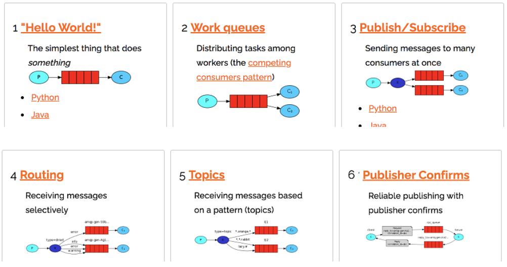
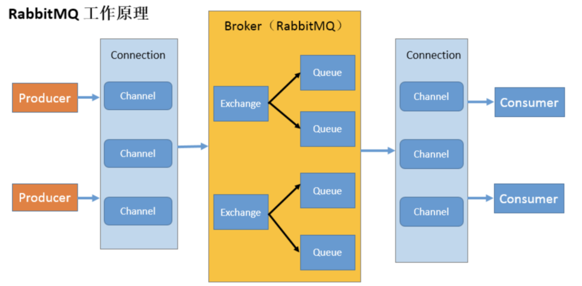
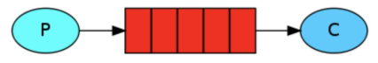

## RabbitMQ 概念
+ RabbitMQ 是一个消息中间件：它接受并转发消息。你可以把它当做一个快递站点，当你要发送一个包裹时，你把你的包裹放到快递站，快递员最终会把你的快递送到收件人那里，按照这种逻辑 RabbitMQ 是一个快递站，一个快递员帮你传递快件。 RabbitMQ 与快递站的主要区别在于，它不处理快件而是接收，存储和转发消息数据。

## 四大核心概念

### 1）生产者（Producer）

+ 产生数据发送消息的程序是生产者

### 2）交换机（Exchange）

+ 交换机是 RabbitMQ 非常重要的一个部件，一方面它接收来自生产者的消息，另一方面它将消息推送到队列中。交换机必须确切知道如何处理它接收到的消息，是将这些消息推送到特定队列还是推送到多个队列，亦或者是把消息丢弃，这个得有交换机类型决定

### 3）队列（Queue）

+ 队列是 RabbitMQ 内部使用的一种数据结构， 尽管消息流经 RabbitMQ 和应用程序，但它们只能存储在队列中。队列仅受主机的内存和磁盘限制的约束，本质上是一个大的消息缓冲区。许多生产者可以将消息发送到一个队列，许多消费者可以尝试从一个队列接收数据。这就是我们使用队列的方式

### 4）消费者（Consumer）

+ 消费与接收具有相似的含义。消费者大多时候是一个等待接收消息的程序。 请注意生产者，消费者和消息中间件很多时候并不在同一机器上。同一个应用程序既可以是生产者又是可以是消费者。

## RabbitMQ 核心部分

## 各个名词介绍

+ Broker：接收和分发消息的应用， RabbitMQ Server 就是 Message Broker
+ Virtual host：出于多租户和安全因素设计的，把 AMQP 的基本组件划分到一个虚拟的分组中，类似于网络中的 namespace 概念。当多个不同的用户使用同一个 RabbitMQ server 提供的服务时，可以划分出多个 vhost，每个用户在自己的 vhost 创建 exchange／ queue 等
+ Connection： publisher／ consumer 和 broker 之间的 TCP 连接
+ Channel：如果每一次访问 RabbitMQ 都建立一个 Connection，在消息量大的时候建立 TCP Connection 的开销将是巨大的，效率也较低。 Channel 是在 connection 内部建立的逻辑连接，如果应用程序支持多线程，通常每个 thread 创建单独的 channel 进行通讯， AMQP method 包含了 channel id 帮助客户端和 message broker 识别 channel，所以 channel 之间是完全隔离的。 Channel 作为轻量级的 Connection 极大减少了操作系统建立 TCP connection 的开销
+ Exchange： message 到达 broker 的第一站，根据分发规则，匹配查询表中的 routing key，分发消息到 queue 中去。常用的类型有： direct (point-to-point), topic (publish-subscribe) and fanout(multicast)
+ Queue： 消息最终被送到这里等待 consumer 取走
+ Binding： exchange 和 queue 之间的虚拟连接， binding 中可以包含 routing key， Binding 信息被保存到 exchange 中的查询表中，用于 message 的分发依据

## 安装
+ erlang
+ mq

## 常用命令

+ 1）添加开机启动 RabbitMQ 服务 
  + chkconfig rabbitmq-server on
  
+ 2）启动服务 
  + /sbin/service rabbitmq-server start

+ 3）查看服务状态 
  + /sbin/service rabbitmq-server status

+ 4）停止服务(选择执行)
  + /sbin/service rabbitmq-server stop

+ 5）开启 web 管理插件 
  + rabbitmq-plugins enable rabbitmq_management

+ 6）访问管理台
  + rabbitmq提供的有web版的管理系统，地址http://localhost:15672/

## 添加一个新的用户

1）创建账号
rabbitmqctl add_user admin 123

2）设置用户角色
rabbitmqctl set_user_tags admin administrator

3）设置用户权限

语法
set_permissions [-p <vhostpath>] <user> <conf> <write> <read>
下面给admin赋权，用户 user_admin 具有/vhost1 这个 virtual host 中所有资源的配置、写、读权限

rabbitmqctl set_permissions -p "/" admin "." "." ".*"

4）查看当前用户和角色

[root@test001 mysoft]# rabbitmqctl list_users
Listing users ...
user    tags
admin    [administrator]
guest    [administrator]

## 再次利用 admin 用户登录

## 重新设置RabbitMQ命令

1）首先关闭RabbitMQ
rabbitmqctl stop_app

2）还原
rabbitmqctl reset

3）启动
rabbitmqctl start_app

## Hello World
+ P”是我们的生产者，“ C”是我们的消费者。中间的框是一个队列-RabbitMQ 代表使用者保留的消息缓冲区
+ 

##  轮询分发消息
