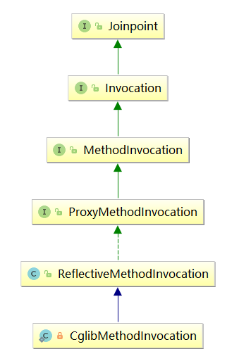
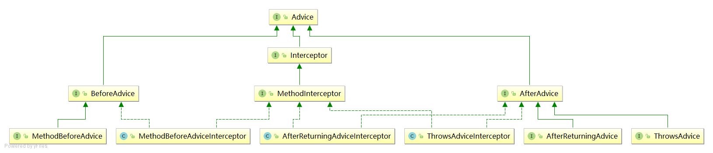
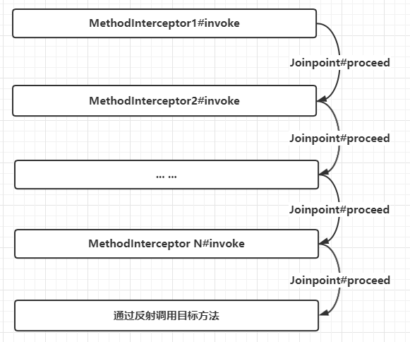

## 连接点（JoinPoint）
+ JoinPoint接口

+ Invocation接口
+ MethodInvocation接口

## 通知(Advice)
+ Advice接口

+ MethodBeforeAdvice接口 
  + 方法执行前通知，需要在目标方法执行前执行一些逻辑的，可以通过这个实现。
+ AfterReturningAdvice接口
  + 方法执行后通知，需要在目标方法执行之后执行增强一些逻辑的，可以通过这个实现。
+ ThrowsAdvice接口
+ MethodInterceptor接口
  + 方法拦截器，这个接口最强大，可以实现上面3种类型的通知，上面3种通知最终都通过适配模式将其转换为MethodInterceptor方式去执行。

+ 拦截器链

## 切入点(PointCut)
+ 通知（Advice）用来指定需要增强的逻辑，但是哪些类的哪些方法中需要使用这些通知呢？这个就是通过切入点来配置的，切入点在spring中对应了一个接口
+ PointCut接口
+ ClassFilter接口
+ MethodMatcher接口

## 顾问(Advisor)
+ Advice定义了需要做什么，PointCut定义了在哪些类的哪些方法中执行通知