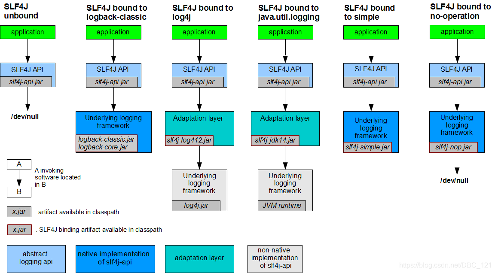

### 使用Maven 手动创建SpringBoot项目
1. pom.xml
```xml
<?xml version="1.0" encoding="UTF-8"?>
<project xmlns="http://maven.apache.org/POM/4.0.0" xmlns:xsi="http://www.w3.org/2001/XMLSchema-instance" xsi:schemaLocation="http://maven.apache.org/POM/4.0.0 https://maven.apache.org/xsd/maven-4.0.0.xsd">
	<modelVersion>4.0.0</modelVersion>
	<groupId>com.hm</groupId>
	<artifactId>pro</artifactId>
	<version>0.0.1</version>
	<parent>
		<groupId>org.springframework.boot</groupId>
		<artifactId>spring-boot-starter-parent</artifactId>
		<version>2.7.3</version>
	</parent>
	<dependencies>
		<dependency>
			<groupId>org.springframework.boot</groupId>
			<artifactId>spring-boot-starter-web</artifactId>
		</dependency>
	</dependencies>
	<build>
		<plugins>
			<plugin>
				<groupId>org.springframework.boot</groupId>
				<artifactId>spring-boot-maven-plugin</artifactId>
			</plugin>
		</plugins>
	</build>
</project>

```

2. 创建启动类和控制器 (路径 src/main/java/com)
```java
package com;
import org.springframework.boot.SpringApplication;
import org.springframework.boot.autoconfigure.EnableAutoConfiguration;
import org.springframework.web.bind.annotation.RequestMapping;
import org.springframework.web.bind.annotation.RestController;

@RestController
@EnableAutoConfiguration
public class MyApplication {
	@RequestMapping("/")
	String home() {
		return "Hello World!";
	}
	public static void main(String[] args) {
		SpringApplication.run(MyApplication.class, args);
	}
}
```
3. mvn dependency:tree
4. mvn spring-boot:run
5. mvn package


### 创建项目
+ 创建一个maven基础项目
  + mvn archetype:generate -DgroupId=springboot -DartifactId=springboot-helloworld -Darchetype ArtifactId=maven-archetype-quickstart -DinteractiveMode=false

+ Spring Boot项目主要的jar包
  + 父pom.xml 文件
```xml
<parent>
  <groupId>org.springframework.boot</groupId>
  <artifactId>spring-boot-starter-parent</artifactId>
  <version>2.6.7</version>
</parent>
```
  + 子pom.xml 文件，可以添加其他 starter 依赖
```xml
  <dependency>
    <groupId>org.springframework.boot</groupId>
    <artifactId>spring-boot-starter-web</artifactId>
  </dependency>
```

+ Controller
+ 启动应⽤类
+ application-{profile}.properties
  + application-dev.properties 、 application-test.properties 、 application-prod.properties
    + java -jar xxx.jar
    + java -jar xxx.jar --spring.profiles.active=test
    + java -jar xxx.jar --spring.profiles.active=prod

+ ⾃动配置
+ 优先级排列：
  1.命令⾏参数
  2.java:comp/env ⾥的 JNDI 属性
  3.JVM 系统属性
  4.操作系统环境变量
  5.RandomValuePropertySource 属性类⽣成的 random.* 属性
  6.应⽤以外的 application.properties（或 yml）⽂件
  7.打包在应⽤内的 application.properties（或 yml）⽂件
  8.在应⽤ @Configuration 配置类中，⽤ @PropertySource 注解声明的属性⽂件
  9.SpringApplication.setDefaultProperties 声明的默认属性


### spring boot 底层于原理
+ spring-boot-starter-parent
+ spring-boot-dependencies
+ 引导类
  + @SpringBootApplication
    + @SpringBootConfiguration
      + 用于定义一个Spring Boot的配置类(配置类 等同 配置文件)引用了 @Configuration 注解，是Spring底层的一个注解，用于定义 Spring 的配置类。 配置类也是容器中的一个组件 @Component。
    + @EnableAutoConfiguration  
      + 告诉Spring Boot开启自动配置功能，这样Spring Boot会自动根据你导入的依赖jar包来自动配置项目。
    + @AutoConfigurationPackage
      + 会将引导类（@SpringBootApplication标注的类）所在的包及下面所有子包里面的所有组件扫描到Spring容器；
    + @Import({AutoConfigurationImportSelector.class})
      + 将所有需要导入的组件以全类名的方式返回; 这些组件就会被添加到容器中 会给容器导入非常多的自动配置类(xxxxAutoConfiguration),就是导入并配置好当前项目中所需要的组件,省去我们手动编写配置去注入组件.
+ 自动配置
  + 在启动的时候从(spring-boot-autoconfigure-x.y.z.jar) 类路径下的META-INF/spring.factories中获取EnableAutoConfiguration指定的值，将这些值作为自动配置类导入到容器中，自动配置类就生效，帮我们进行自动配置工作


### spring boot 核心配置
+ application.yml
+ YAML
+ @ConfigurationProperties
+ @Value  
+ @PropertySource
  + @PropertySource(value = {"classpath:emp.properties"})
+ @ImportResource
  + @ImportResource(locations = {"classpath:spring01.xml"})
+ 自定义配置类向容器注入组件
  + 使用 @Configuration 配置类，来表示对应Spring配置文件
  + 使用 @Bean 向容器中注入组件对象
+ Profile 多环境支持
  + application-dev.properties
  + application-test.properties
  + application-prod.properties

  + application.properties
    + spring.profiles.active=test

  + java -jar xxx.jar --spring.profiles.active=test

  + application.properties 中配置通⽤内容，并设置 spring.profiles.active=dev ，以开发环境为默认配置
  + application-{profile}.properties 中配置各个环境不同的内容
  + 通过命令⾏⽅式去激活不同环境的配置


+ @Configuration  相当于spring中xml文件中的beans 标签
+ @Bean 相当于spring中xml文件的bean 标签


+ 配置文件位置
  + file:./config/ 当前项目的config目录下（最高级别）
  + file:./ 当前项目的根目录下
  + classpath:/config/ 类路径的config目录下
  + classpath:/ 类路径的根目录下（最低级别）

  
### springboot 打包

SpringBoot 可以打包成jar 和 war

pom.xml 文件中，需要增加下面的包，这样打包时，才会将所有的第三方包也打包在一起。
```xml
<plugins>
<!-- spring-boot-maven-plugin (提供了直接运行项目的插件：如果是通过parent方式继承spring-boot-starter-parent则不用此插件) -->
<plugin>
<groupId>org.springframework.boot</groupId>
<artifactId>spring-boot-maven-plugin</artifactId>
<!--将本地依赖jar打包到部署包中 -->
<configuration>
<includeSystemScope>true</includeSystemScope>
</configuration>
<version>${spring-boot.version}</version>
<executions>
<execution>
<goals>
<goal>repackage</goal>
</goals>
</execution>
</executions>
</plugin>
</plugins>
```
问题描述：spring boot使用maven的package命令打出来的包，却不包含依赖的jar包
问题原因：打包时使用了maven默认的maven-jar-plugin插件，而不是spring-boot-maven-plugin插件


### starter

| 名称                                     | 描述                                                                 |
|----------------------------------------|--------------------------------------------------------------------|
| spring-boot-starter	                   | 核心Spring Boot starter，包括自动配置支持，日志和YAML                             |
| spring-boot-starter-actuator           | 生产准备的特性，用于帮你监控和管理应用                                                |
| spring-boot-starter-remote-shell       | 提供基于ssh协议的监和管理                                                     |
| spring-boot-starter-amqp               | 对”高级消息队列协议”的支持，通过spring-rabbit实现                                   |
| spring-boot-starter-aop                | 对面向切面编程的支持，包括spring-aop和AspectJ                                    |
| spring-boot-starter-batch              | 对Spring Batch的支持，包括HSQLDB数据库                                       |
| spring-boot-starter-cache              | 对Spring Cache 抽象的支持                                                |
| spring-boot-starter-cloud-connectors   | 对Spring Cloud Connectors的支持，简化在云平台下（例如，Cloud Foundry 和Heroku）服务的连接 |
| spring-boot-starter-data-elasticsearch | 对Elasticsearch搜索和分析引擎的支持，包括spring-data-elasticsearch               |
| spring-boot-starter-data-gemfire	      | 对GemFire分布式数据存储的支持，包括spring-data-gemfire                           |
| spring-boot-starter-data-jpa           | 对”Java持久化API”的支持，包括spring-data-jpa，spring-orm和Hibernate            |
| spring-boot-starter-data-mongodb       | 对MongoDB NOSQL数据库的支持，包括spring-data-mongodb                         |
| spring-boot-starter-data-rest          | 对通过REST暴露Spring Data仓库的支持，通过spring-data-rest-webmvc实现              |
| spring-boot-starter-data-solr          | 对Apache Solr搜索平台的支持，包括spring-data-solr                             |
| spring-boot-starter-freemarker         | 对FreeMarker模板引擎的支持                                                 |
| spring-boot-starter-groovy-templates   | 对Groovy模板引擎的支持                                                     |
| spring-boot-starter-hateoas	           | 对基于HATEOAS的RESTful服务的支持，通过spring-hateoas实现                         |
| spring-boot-starter-hornetq	           | 对”Java消息服务API”的支持，通过HornetQ实现                                      |
| spring-boot-starter-integration	       | 对普通spring-integration模块的支持                                         |
| spring-boot-starter-jdbc	              | 	对JDBC数据库的支持                                                       |
| spring-boot-starter-jersey	            | 	对Jersey RESTful Web服务框架的支持                                        |
| spring-boot-starter-jta-atomikos       | 		对JTA分布式事务的支持，通过Atomikos实现                                        |
| spring-boot-starter-jta-bitronix	      | 	对JTA分布式事务的支持，通过Bitronix实现                                         |
| spring-boot-starter-mail               | 		对javax.mail的支持                                                   |
| spring-boot-starter-mobile             | 		对spring-mobile的支持                                                |
| spring-boot-starter-mustache	          | 	对Mustache模板引擎的支持                                                  |
| spring-boot-starter-redis	             | 	对REDIS键值数据存储的支持，包括spring-redis                                    |
| spring-boot-starter-security           | 		对spring-security的支持                                              |
| spring-boot-starter-social-facebook    | 		对spring-social-facebook的支持                                       |
| spring-boot-starter-social-linkedin	   | 	对spring-social-linkedin的支持                                        |
| spring-boot-starter-social-twitter     | 		对spring-social-twitter的支持                                        |
| spring-boot-starter-test	              | 	对常用测试依赖的支持，包括JUnit, Hamcrest和Mockito，还有spring-test模块              |
| spring-boot-starter-thymeleaf	         | 	对Thymeleaf模板引擎的支持，包括和Spring的集成                                    |
| spring-boot-starter-velocity           | 		对Velocity模板引擎的支持                                                 |
| spring-boot-starter-web	               | 	对全栈web开发的支持，包括Tomcat和spring-webmvc                                |
| spring-boot-starter-websocket          | 	对WebSocket开发的支持                                                   |
| spring-boot-starter-ws	                | 对Spring Web服务的支持                                                   |
| spring-boot-starter-jetty	             | 导入Jetty HTTP引擎（作为Tomcat的替代）                                        |
| spring-boot-starter-log4j	             | 对Log4J日志系统的支持                                                      |
| spring-boot-starter-logging	           | 导入Spring Boot的默认日志系统（Logback）                                      |
| spring-boot-starter-tomcat	            | 导入Spring Boot的默认HTTP引擎（Tomcat）                                     |
| spring-boot-starter-undertow	          | 导入Undertow HTTP引擎（作为Tomcat的替代）                                     |


## YAML 语法

## 日志
+ 日志的抽象层
  + JCL（Jakarta Commons Logging）
  + SLF4j（Simple Logging Facade for Java）
  + jboss-logging
+ 日志实现
  + Log4j
  + JUL（java.util.logging）
  + Log4j2
  + Logback
  
+ SLF4j 使用


## 10. redis
+ 缓存中间件

数据类型
Redis中所有的数据都是字符串。命令不区分大小写，key是区分大小写的。
五种数据类型:
  String：<key, value>
  Hash： <key，fields-values>
  List：有顺序可重复
  Set：无顺序不可重复
  Sorted Sets (zset) ：有顺序，不能重复

String：<key, value>
  set、get
  incr：加一（生成id）
  decr：减一
  append：追加内容
  del key_name ：删除指定
  keys * ： 查看所有的 key

Hash：<key，fields-values>
  相当于一个key对于一个Map，Map中还有key-value, 使用hash对key进行归类。
  Hset：向hash中添加内容
  Hget：从hash中取内容

List：有顺序可重复
  lpush：向List中左边添加元素
  lrange：查询指定范围的所有元素
  rpush：向List中右边添加元素
  lpop：弹出List左边第一个元素
  rpop：弹出List右边第一个元素

Set：元素无顺序，不能重复
  sadd：添加一个或多个元素到集合中
  smembers：获取所有元素
  srem：移除指定的元素   


SortedSet（zset）：有顺序，不能重复
  zadd key值 元素得分 元素：添加一个或多个元素到有序列set中，按元素得分由小到大排列
  zrange：查询指定范围的所有元素
  zrem：移除指定的元素


## 多数据源
+ 通过包名
+ 通过注解
+ 2个数据库
  + 配置2个数据源
  + 创建配置类
    + 创建datasource
    + 创建sqlsessionfactory
    + 创建datasourcetransactionManger
    + 创建sqlsessiontemplate
+ @primary

## solr


