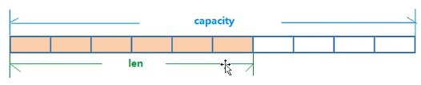

**第1篇：Redis概述和安装
第2篇：Redis 5大数据类型
第3篇：Redis的发布和订阅
第4篇：Redis新的3种数据类型
第5篇：Jedis操作Redis6
第6篇：SpringBoot2整合Redis
第7篇：Redis事务操作
第8篇：Redis持久化之RDB(Redis DataBase)
第9篇：Redis持久化之AOF(Append Only File)
第10篇：Redis主从复制
第11篇：Redis集群(Cluster)
第12篇：Redis应用问题解决(缓存穿透、击穿、雪崩、分布式锁)


## 安装
```text
   tar -zvxf redis-6.2.1.tar.gz
   yum install gcc
   cd redis-6.2.1
   make
   make install
   
redis-benchmark：性能测试工具，可以在自己本子允许，看看自己本子性能如何
redis-check-aof：修复有问题的AOF文件，rdb和aof后面讲
redis-check-dump：修复有问题的dump.rdb文件
redis-sentinel：redis集群使用
redis-server：redis服务器启动命令
redis-clit：客户端，操作入口
```

## 启动redis
```text
方式1：前台启动（不推荐）
    redis-server

方式2：后端启动（推荐）
（1）复制redis.conf文件到/etc目录
    cp /opt/redis-6.2.1/redis.conf /etc
（2）使用vi命令修改/etc/redis.config中的配置，将后台启动设置daemonize改为yes，如下
    daemonize yes
（3）启动redis
    redis-server /etc/redis.conf
```
## redis介绍相关知识
```text
默认端口6379
默认16个数据库，类似数组的下标从0开始，初始默认使用0号库
使用select <dbid>来切换数据库，如：select 1，切换到第2个库
统一密码管理，所有的库密码相同
dbsize：查看当前数据库的key的数量
flushdb：情况当前库
flushall：清空全部库
```


## 5大数据类型
redis字符串（String）
redis列表（List）
redis集合（Set）
redis哈希表（Hash）
redis有序集合（Zset）


### redis键（key）
```text
keys *：查看当前库所有的key
exists key：判断某个key是否存在
type key：查看你的key是什么类型
del key：删除指定的key数据
unlink key：根据value删除非阻塞删除，仅仅将keys从keyspace元数据中删除，真正的删除会在后续异步中操作。
expire key 10：为指定的key设置有效期10秒
ttl key：查看指定的key还有多少秒过期，-1：表示永不过期，-2：表示已过期
select dbindex：切换数据库【0-15】，默认为0
dbsize：查看当前数据库key的数量
flushdb：清空当前库
flushall：通杀全部库
```

### 5大数据类型

#### String

简介
String是Redis最基本的类型，你可以理解成与Memcached一模一样的类型，一个key对应一个value。
String类型是二进制安全的。意味着Redis的string可以包含任何数据。比如jpg图片或者序列化的对象。
String类型是Redis最基本的数据类型，一个Redis中字符串value最多可以是512M

数据结构
String的数据结构为简单动态字符串（Simple Dynamic String，缩写SDS）。是可以修改的字符串，内部结构上类似于Java的ArrayList，采用分配冗余空间的方式来减少内存的频繁分配。
如图所示，内部为当前字符串实际分配的空间capacity一般要高于实际字符串长度len。当字符串长度小于1M时，扩容都是加倍现有的空间，如果超过1M，扩容时一次会多扩容1M的空间。
要注意的是字符串最大长度为512M。


```text
set：添加键值对
set key value [EX seconds|PX milliseconds|EXAT timestamp|PXAT milliseconds-timestamp|KEEPTTL] [NX|XX] [GET]
NX：当数据库中key不存在时，可以将key-value添加到数据库
XX：当数据库中key存在时，可以将key-value添加数据库，与NX参数互斥
EX：key的超时秒数
PX：key的超时毫秒数，与EX互斥
value中若包含空格、特殊字符，需用双引号包裹

get：获取值
get <key>

apend：追加值
append <key> <value>
将给定的value追加到原值的末尾。

strlen：获取值的长度
strlen <key>

incr：原子递增1
incr <key>
将key中存储的值增1，只能对数字值操作，如果key不存在，则会新建一个，值为1

decr：原子递减1
decr <key>
将key中存储的值减1，只能对数字值操作，如果为空，新增值为-1

incrby/decrby：递增或者递减指定的数字
incrby/decrby <key> <步长>
将key中存储的数字值递增指定的步长，若key不存在，则相当于在原值为0的值上递增指定的步长。

mset：同时设置多个key-value
mset <key1> <value1> <key2> <value2> ...

mget：获取多个key对应的值
mget <key1> <key2> ...

msetnx：当多个key都不存在时，则设置成功
msetnx <key1> <value1> <key2> <value2> ...
原子性的，要么都成功，或者都失败。

getrange：获取值的范围，类似java中的substring
getrange key start end
获取[start,end]返回为的字符串

setrange：覆盖指定位置的值
setrange <key> <起始位置> <value>

setex：设置键值&过期时间（秒）
setex <key> <过期时间(秒)> <value>

getset：以新换旧，设置新值同时返回旧值
getset <key> <value>
```
#### List
单键多值
redis列表是简单的字符串列表，按照插入顺序排序。
你可以添加一个元素到列表的头部（左边）或者尾部（右边）。
它的底层实际上是使用双向链表实现的，对两端的操作性能很高，通过索引下标操作中间节点性能会较差。

List的数据结构为快速链表quickList
首先在列表元素较少的情况下会使用一块连续的内存存储，这个结构是ziplist，也就是压缩列表。
它将所有的元素紧挨着一起存储，分配的是一块连续的内存。
当就比较多的时候才会改成quickList。
因为普通的链表需要的附加指针空间太大，会比较浪费空间，比如这个列表里存储的只是int类型的书，结构上还需要2个额外的指针prev和next。
redis将链表和ziplist结合起来组成了quicklist。也就是将多个ziplist使用双向指针串起来使用，这样既满足了快速的插入删除性能，又不会出现太大的空间冗余。


```text
lpush/rpush：从左边或者右边插入一个或多个值
lpush/rpush <key1> <value1> <key2> <value2> ...

lrange：从列表左边获取指定范围内的值
lrange <key> <star> <stop>
返回列表 key 中指定区间内的元素，区间以偏移量 start 和 stop 指定。
下标(index)参数 start 和 stop 都以 0 为底，也就是说，以 0 表示列表的第一个元素，以 1 表示列表的第二个元素，以此类推。
你也可以使用负数下标，以 -1 表示列表的最后一个元素， -2 表示列表的倒数第二个元素，以此类推。
返回值:
一个列表，包含指定区间内的元素。


lpop/rpop：从左边或者右边弹出多个元素
lpop/rpop <key> <count>
count：可以省略，默认值为1

lpop/rpop 操作之后，弹出来的值会从列表中删除

值在键在，值亡键亡。


rpoplpush：从一个列表右边弹出一个元素放到另外一个列表中
rpoplpush source destination
从source的右边弹出一个元素放到destination列表的左边


lindex：获取指定索引位置的元素（从左到右）
lindex key index
返回列表 key 中，下标为 index 的元素。
下标(index)参数 start 和 stop 都以 0 为底，也就是说，以 0 表示列表的第一个元素，以 1 表示列表的第二个元素，以此类推。
你也可以使用负数下标，以 -1 表示列表的最后一个元素， -2 表示列表的倒数第二个元素，以此类推。
如果 key 不是列表类型，返回一个错误。
返回值:
列表中下标为 index 的元素。
如果 index 参数的值不在列表的区间范围内(out of range)，返回 nil


llen：获得列表长度
llen key
返回列表 key 的长度。
如果 key 不存在，则 key 被解释为一个空列表，返回 0 .
如果 key 不是列表类型，返回一个错误。

linsert：在某个值的前或者后面插入一个值
linsert <key> before|after <value> <newvalue>
将值 newvalue 插入到列表 key 当中，位于值 value之前或之后。

当 value 不存在于列表 key 时，不执行任何操作。
当 key 不存在时， key 被视为空列表，不执行任何操作。
如果 key 不是列表类型，返回一个错误。

返回值:
如果命令执行成功，返回插入操作完成之后，列表的长度。
如果没有找到 value ，返回 -1 。
如果 key 不存在或为空列表，返回 0 。


lrem：删除指定数量的某个元素
LREM key count value
根据参数 count 的值，移除列表中与参数 value 相等的元素。

count 的值可以是以下几种：

count > 0 : 从表头开始向表尾搜索，移除与 value 相等的元素，数量为 count 。
count < 0 : 从表尾开始向表头搜索，移除与 value 相等的元素，数量为 count 的绝对值。
count = 0 : 移除表中所有与 value 相等的值。
返回值：
被移除元素的数量。
因为不存在的 key 被视作空表(empty list)，所以当 key 不存在时，总是返回 0 。


   lset：替换指定位置的值
   lset <key> <index> <value>
   将列表 key 下标为 index 的元素的值设置为 value 。

当 index 参数超出范围，或对一个空列表( key 不存在)进行lset时，返回一个错误。

返回值：

操作成功返回 ok ，否则返回错误信息。
```

#### Set
redis set对外提供的功与list类似，是一个列表的功能，特殊之处在于set是可以自动排重的，当你需要存储一个列表数据，又不希望出现重复数据时，set是一个很好的选择。
redis的set是string类型的无序集合，他的底层实际是一个value为null的hash表，所以添加，删除，查找复杂度都是O(1)。
一个算法，如果时间复杂度是O(1)，那么随着数据的增加，查找数据的时间不变，也就是不管数据多少，查找时间都是一样的。

set数据结构是字典，字典是用hash表实现的。
Java中的HashSet的内部实现使用HashMap，只不过所有的value都指向同一个对象。
Redis的set结构也是一样的，它的内部也使用hash结构，所有的value都指向同一个内部值。

```text
sadd：添加一个或多个元素
sadd <key> <value1> <value2> ...

smembers：取出所有元素
smembers <key>

sismember：判断集合中是否有某个值
sismember <key> <value>
判断集合key中是否包含元素value，1：有，0：没有

scard：返回集合中元素的个数
scard <key>
返回集合 key 的基数(集合中元素的数量)
返回值： 集合的基数。 当 key 不存在时，返回 0 。

srem：删除多个元素
srem key member [member ...]
移除集合 key 中的一个或多个 member 元素，不存在的 member 元素会被忽略。
当 key 不是集合类型，返回一个错误。
返回值:被成功移除的元素的数量，不包括被忽略的元素。

  
spop：随机弹出多个值
spop <key> <count>
随机从key集合中弹出count个元素，count默认值为1
返回值: 被移除的随机元素。
当 key 不存在或 key 是空集时，返回 nil

srandmember：随机获取多个元素，不会从集合中删除
srandmember <key> <count>
从key指定的集合中随机返回count个元素，count可以不指定，默认值是1。

srandmember 和 spop的区别：
都可以随机获取多个元素，srandmember 不会删除元素，而spop会删除元素。
返回值:只提供 key 参数时，返回一个元素；如果集合为空，返回 nil 。 如果提供了 count 参数，那么返回一个数组；如果集合为空，返回空数组。


smove：将某个原创从一个集合移动到另一个集合
smove <source> <destination> member
将 member 元素从 source 集合移动到 destination 集合。

smove 是原子性操作。

如果 source 集合不存在或不包含指定的 member 元素，则 smove 命令不执行任何操作，仅返回 0 。
否则， member 元素从 source 集合中被移除，并添加到 destination 集合中去。

当 destination 集合已经包含 member 元素时，smove 命令只是简单地将 source 集合中的 member 元素删除。
当 source 或 destination 不是集合类型时，返回一个错误。

返回值:如果 member 元素被成功移除，返回 1 。如果 member 元素不是 source 集合的成员，并且没有任何操作对 destination 集合执行，那么返回 0 。

sinter：取多个集合的交集
sinter key [key ...]

sinterstore：将多个集合的交集放到一个新的集合中
sinterstore destination key [key ...]
这个命令类似于sinter命令，但它将结果保存到 destination 集合，而不是简单地返回结果集。
返回值: 结果集中的成员数量。

sunion：取多个集合的并集，自动去重
sunion key [key ...]

sunionstore：将多个集合的并集放到一个新的集合中
sinterstore destination key [key ...]
这个命令类似于 sunion 命令，但它将结果保存到 destination 集合，而不是简单地返回结果集。
返回值: 结果集中的成员数量。

sdiff：取多个集合的差集
SDIFF key [key ...]
返回一个集合的全部成员，该集合是所有给定集合之间的差集。
不存在的 key 被视为空集。

sdiffstore：将多个集合的差集放到一个新的集合中
sdiffstore destination key [key ...]
这个命令类似于 sdiff 命令，但它将结果保存到 destination 集合，而不是简单地返回结果集。
返回值: 结果集中的成员数量。
```

#### Hash
Redis hash是一个键值对集合。
Redis hash是一个string类型的field和value的映射表，hash特别适合用于存储对象。
类似于java里面的Map<String,Object>

Hash类型对应的数据结构是2中：ziplist（压缩列表），hashtable（哈希表）。
当field-value长度较短个数较少时，使用ziplist，否则使用hashtable。
```text

hset：设置多个field的值
hset key field value [field value ...]
将哈希表 key 中的域 field 的值设为 value 。
如果 key 不存在，一个新的哈希表被创建并进行 hset 操作。
如果域 field 已经存在于哈希表中，旧值将被覆盖。

返回值：
如果 field 是哈希表中的一个新建域，并且值设置成功，返回 1 。
如果哈希表中域 field 已经存在且旧值已被新值覆盖，返回 0 。

hget：获取指定filed的值
hget key field

hgetall：返回hash表所有的域和值
hgetall key

hexists：判断给定的field是否存在，1：存在，0：不存在
hexists key field
查看哈希表 key 中，给定域 field 是否存在。

返回值：
如果哈希表含有给定域，返回 1 。
如果哈希表不含有给定域，或 key 不存在，返回 0 。

hkeys：列出所有的filed
hkeys key

   hvals：列出所有的value
   hvals key

   hlen：返回filed的数量
   HLEN key
   返回哈希表 key 中域的数量。

返回值：哈希表中域的数量。当 key 不存在时，返回 0 。


hincrby：filed的值加上指定的增量
hincrby key field increment
为哈希表 key 中的域 field 的值加上增量 increment 。

增量也可以为负数，相当于对给定域进行减法操作。

如果 key 不存在，一个新的哈希表被创建并执行 HINCRBY 命令。

如果域 field 不存在，那么在执行命令前，域的值被初始化为 0 。

对一个储存字符串值的域 field 执行 HINCRBY 命令将造成一个错误。

返回值：

执行 hincrby 命令之后，哈希表 key 中域 field 的值。


hsetnx：当filed不存在的时候，设置filed的值
hsetnx key field value
将哈希表 key 中的域 field 的值设置为 value ，当且仅当域 field 不存在。若域 field 已经存在，该操作无效。
如果 key 不存在，一个新哈希表被创建并执行 hsetnx 命令。

返回值：设置成功，返回 1 。如果给定域已经存在且没有操作被执行，返回 0 。
```

#### Zset（sorted set）
redis有序集合zset与普通集合set非常相似，是一个没有重复元素的字符串集合。
不同之处是有序集合的每个成员都关联了一个评分（score），这个评分（score）被用来按照从最低分到最高分的方式排序集合中的成员。
集合的成员是唯一的，但是评分是可以重复的。
因为元素是有序的，所以你可以很快的根据评分（score）或者次序（position）来获取一个范围的元素。
访问有序集合中的中间元素也是非常快的，因为你能够使用有序集合作为一个没有重复成员你的智能列表。

SortedSet（zset）是redis提供的一个非常特别的数据结构，内部使用到了2种数据结构。

1、hash表
类似于java中的Map<String,score>，key为集合中的元素，value为元素对应的score，可以用来快速定位元素定义的score，时间复杂度为O(1)

2、跳表

跳表（skiplist）是一个非常优秀的数据结构，实现简单，插入、删除、查找的复杂度均为O(logN)。
类似java中的ConcurrentSkipListSet，根据score的值排序后生成的一个跳表，可以快速按照位置的顺序或者score的顺序查询元素。

这里我们来看一下跳表的原理：

首先从考虑一个有序表开始：

从该有序表中搜索元素 < 23, 43, 59 > ，需要比较的次数分别为 < 2, 4, 6 >，总共比较的次数为 2 + 4 + 6 = 12 次。有没有优化的算法吗? 链表是有序的，但不能使用二分查找。类似二叉搜索树，我们把一些节点提取出来，作为索引。得到如下结构：
这里我们把 < 14, 34, 50, 72 > 提取出来作为一级索引，这样搜索的时候就可以减少比较次数了。我们还可以再从一级索引提取一些元素出来，作为二级索引，变成如下结构：
这里元素不多，体现不出优势，如果元素足够多，这种索引结构就能体现出优势来了。
 
```text
zadd：添加元素
zadd <key> <score1> <member1> <score2> <member2> ...
将一个或多个 member 元素及其 score 值加入到有序集 key 当中。
如果某个 member 已经是有序集的成员，那么更新这个 member 的 score 值，并通过重新插入这个 member 元素，来保证该 member 在正确的位置上。
score 值可以是整数值或双精度浮点数。
如果 key 不存在，则创建一个空的有序集并执行 zadd 操作。
当 key 存在但不是有序集类型时，返回一个错误。
返回值: 被成功添加的新成员的数量，不包括那些被更新的、已经存在的成员。


zrange：score升序，获取指定索引范围的元素
zrange key start top [withscores]
返回存储在有序集合key中的指定范围的元素。 返回的元素可以认为是按score从最低到最高排列，如果得分相同，将按字典排序。

下标参数 start 和 stop 都以 0 为底，也就是说，以 0 表示有序集第一个成员，以 1 表示有序集第二个成员，以此类推。

你也可以使用负数下标，以 -1 表示最后一个成员， -2 表示倒数第二个成员，以此类推。

zrange key 0 -1：可以获取所有元素

withscores：让成员和它的 score 值一并返回，返回列表以 value1,score1, ..., valueN,scoreN 的格式表示

可用版本：

>= 1.2.0

时间复杂度:

O(log(N)+M)， N 为有序集的基数，而 M 为结果集的基数。

返回值:

指定区间内，带有 score 值(可选)的有序集成员的列表。

 
   zrevrange：score降序，获取指定索引范围的元素
   zrevrange key start stop [WITHSCORES]
   返回存储在有序集合key中的指定范围的元素。 返回的元素可以认为是按score最高到最低排列， 如果得分相同，将按字典排序。

下标参数 start 和 stop 都以 0 为底，也就是说，以 0 表示有序集第一个成员，以 1 表示有序集第二个成员，以此类推。

你也可以使用负数下标，以 -1 表示最后一个成员， -2 表示倒数第二个成员，以此类推。

withscores：让成员和它的 score 值一并返回，返回列表以 value1,score1, ..., valueN,scoreN 的格式表示

 
   zrangebyscore：按照score升序，返回指定score范围内的数据
   zrangebyscore key min max [WITHSCORES] [LIMIT offset count]
   返回有序集 key 中，所有 score 值介于 min 和 max 之间(包括等于 min 或 max )的成员。有序集成员按 score 值递增(从小到大)次序排列。

具有相同 score 值的成员按字典序来排列(该属性是有序集提供的，不需要额外的计算)。

可选的 LIMIT 参数指定返回结果的数量及区间(就像SQL中的 SELECT LIMIT offset, count )，注意当 offset 很大时，定位 offset 的操作可能需要遍历整个有序集，此过程最坏复杂度为 O(N) 时间。

可选的 WITHSCORES 参数决定结果集是单单返回有序集的成员，还是将有序集成员及其 score 值一起返回。

 
   zrevrangebyscore：按照score降序，返回指定score范围内的数据
   zrevrangebyscore key max min [WITHSCORES] [LIMIT offset count]
   返回有序集 key 中， score 值介于 max 和 min 之间(默认包括等于 max 或 min )的所有的成员。有序集成员按 score 值递减(从大到小)的次序排列。

具有相同 score 值的成员按字典序的逆序排列。

除了成员按 score 值递减的次序排列这一点外， zrevrangebyscore 命令的其他方面和 zrangebyscore 命令一样。

 
   zincrby：为指定元素的score加上指定的增量
   zincrby key increment member
   为有序集 key 的成员 member 的 score 值加上增量 increment 。

可以通过传递一个负数值 increment ，让 score 减去相应的值，比如 ZINCRBY key -5 member ，就是让 member 的 score 值减去 5 。

当 key 不存在，或 member 不是 key 的成员时， ZINCRBY key increment member 等同于 ZADD key increment member 。

当 key 不是有序集类型时，返回一个错误。

score 值可以是整数值或双精度浮点数。

 
   zrem：删除集合中多个元素
   zrem key member [member ...]
   移除有序集 key 中的一个或多个成员，不存在的成员将被忽略。

当 key 存在但不是有序集类型时，返回一个错误。

 
   zremrangebyrank：根据索引范围删除元素
   zremrangebyrank key start stop
   移除有序集 key 中，指定排名(rank)区间内的所有成员。

区间分别以下标参数 start 和 stop 指出，包含 start 和 stop 在内。

下标参数 start 和 stop 都以 0 为底，也就是说，以 0 表示有序集第一个成员，以 1 表示有序集第二个成员，以此类推。

你也可以使用负数下标，以 -1 表示最后一个成员， -2 表示倒数第二个成员，以此类推。

 
   zremrangebyscore：根据score的范围删除元素
   zremrangebyscore key min max
   移除有序集 key 中，所有 score 值介于 min 和 max 之间(包括等于 min 或 max )的成员

 
   zcount：统计指定score范围内元素的个数
   zcount key min max
   返回有序集 key 中， score 值在 min 和 max 之间(默认包括 score 值等于 min 或 max )的成员的数量

 
zrank：按照score升序，返回某个元素在集合中的排名
zrank key member
返回有序集 key 中成员 member 的排名。其中有序集成员按 score 值递增(从小到大)顺序排列。

排名以 0 为底，也就是说， score 值最小的成员排名为 0 。

 
   zrevrank：按照score降序，返回某个元素在集合中的排名
   返回有序集 key 中成员 member 的排名。其中有序集成员按 score 值递减(从大到小)排序。

排名以 0 为底，也就是说， score 值最大的成员排名为 0 。

 
   zscore：返回集合中指定元素的score
   zscore key member
   返回有序集 key 中，成员 member 的 score 值。

如果 member 元素不是有序集 key 的成员，或 key 不存在，返回 nil 。

```


### 发布订阅

redis发布订阅（pub/sub）是一种消息通信模式：发布者（pub）发布消息，订阅者（sub）接收消息。
redis客户端可以订阅任意数量的频道。


### Jedis 