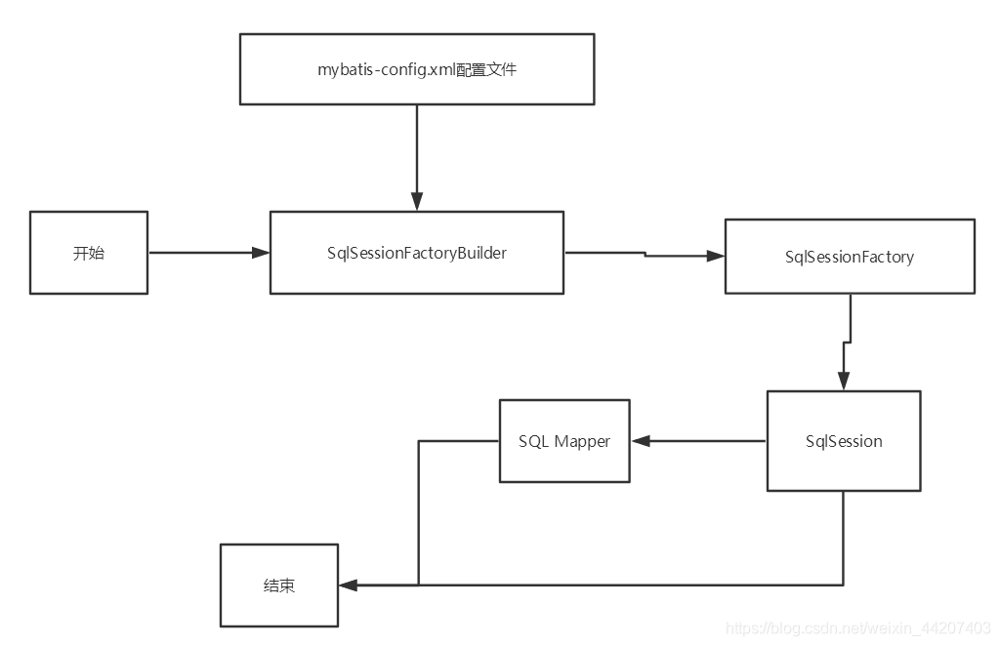
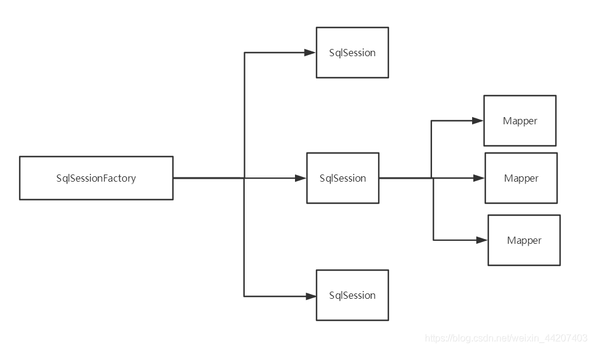

## 原生mybatis
+ mybatis 解决什么问题
  + jdbc重复过程
  + sql的拼接

### 具体步骤
+ 引入jar包
+ 创建 mybatis-config.xml 
+ 创建 mapper xml 
+ 创建 mapper 接口文件
+ 通过mybatis获取Mapper接口执行对db的操作

### Mybatis核心对象介绍
#### SqlSessionFactoryBuilder
+ 这个是一个构建器，通过名字大家也可以感觉到SqlSessionFactoryBuilder构建器，是用来构建SqlSessionFactory对象的，SqlSessionFactoryBuilder可以通过读取mybatis的配置文件，然后构建一个SqlSessionFactory对象，一个项目中有很多mapper xml文件，如果每次操作都去重新解析是非常慢的，那么怎么办？
+ 能不能第一次解析好然后放在内存中，以后直接使用，SqlSessionFactoryBuilder就是搞这个事情的，将mybatis配置文件、com.hm.mapper xml文件、com.hm.mapper xml文件和Mapper 接口的映射关系，这些都先给解析好，然后放在java对象中，java对象存在于内存中，内存中访问会非常快的，那么我们每次去用的时候就不需要重新去解析xml了，SqlSessionFactoryBuilder解析配置之后，生成的对象就是SqlSessionFactory，这个是一个重量级的对象，创建他是比较耗时的，所以一般一个db我们会创建一个SqlSessionFactory对象，然后在系统运行过程中会一直存在，而SqlSessionFactoryBuilder用完了就可以释放了。

#### SqlSessionFactory
+ 通过名字可以知道，这个是一个工厂，是用来创建SqlSession的工厂，SqlSessionFactory是一个重量级的对象，一般一个db对应一个SqlSessionFactory对象，系统运行过程中会一直存在。

+ SqlSessionFactory是一个接口，这个接口有2个实现DefaultSqlSessionFactory和SqlSessionManager，一般都是通过SqlSessionFactoryBuilder来创建SqlSessionFactory对象。

+ 通过SqlSessionFactoryBuilder来创建SqlSessionFactory对象主要有2种方式，一种通过读取mybatis配置文件的方式，另外一种是硬编码的方式，这个后面会专门抽一篇文件介绍这块，springboot中会使用到硬编码的方式，所以这块会详细介绍。

#### SqlSession
+ 我们通过jdbc操作数据库需要先获取一个Connection连接，然后拿着这个连接去对db进行操作，在mybatis中SqlSession就类似于jdbc中Connection连接对象，在mybatis中叫做Sql会话对象，一般我们一个db操作使用一个SqlSession对象，所以这个对象一般是方法级别的，方法结束之后，这个对象就销毁了，这个对象可以调用sqlSessionFactory.openSession的方法来进行获取。

+ 我们可以直接通过SqlSession对象来调用mapper xml中各种db操作，需要指定具体的操作的id，id的格式为namespace.操作的id。

#### Mapper接口
+ 我们可以通过SqlSession直接调用mapper xml中的db操作，不过更简单的以及推荐的方式是使用Mapper接口，Mapper接口中的方法和mapper xml文件中的各种db操作建立了映射关系，是通过Mapper接口完整名称+方法名称和mapper xml中的namespace+具体操作的id来进行关联的，然后我们直接调用Mapper接口中的方法就可以间接的操作db了，使用想当方便，Mapper接口需要通过SqlSession获取，传入Mapper接口对应的Class对象，然后会返回这个接口的实例，如：
+ UserMapper com.hm.mapper = sqlSession.getMapper(UserMapper.class);

### 配置文件



### 别名
```text
方式1
使用typeAlias元素进行注册
如下：

<typeAliases>
    <typeAlias type="玩转的类型名称" alias="别名" />
</typeAliases>
typeAliases元素中可以包含多个typeAlias子元素，每个typeAlias可以给一个类型注册别名，有2个属性需要指定：

type：完整的类型名称

alias：别名

方式2
通过packege元素批量注册
<typeAliases>
    <package name="需要扫描的包"/>
</typeAliases>

方式3
package结合@Alias批量注册并指定别名
```

### 属性配置文件详解
```text

```

### mappers（映射器）
Mapper配置的几种方法：
<mapper resource=" " />
使用相对于类路径的资源
如：<mapper resource="sqlmap/User.xml" />

<mapper class=" " />
使用mapper接口类路径
如：<mapper class="cn.xx.mybatis.mapper.UserMapper"/>
注意：此种方法要求mapper接口名称和mapper映射文件名称相同，且放在同一个目录中。

<package name=""/>
注册指定包下的所有mapper接口
如：<package name="cn.xx.mybatis.mapper"/>
注意：此种方法要求mapper接口名称和mapper映射文件名称相同，且放在同一个目录中。


### mybatis 架构


#{}和${}
#{}表示一个占位符号，通过#{}可以实现preparedStatement向占位符中设置值，自动进行java类型和jdbc类型转换，#{}可以有效防止sql注入。 #{}可以接收简单类型值或pojo属性值。 如果parameterType传输单个简单类型值，#{}括号中可以是value或其它名称。

${}表示拼接sql串，通过${}可以将parameterType 传入的内容拼接在sql中且不进行jdbc类型转换， ${}可以接收简单类型值或pojo属性值，如果parameterType传输单个简单类型值，${}括号中只能是value。

+ Mapper接口开发需要遵循以下规范：
  + 1、接口的全路径和mapper文件中的namespace保持一致
  + 2、接口的方法名和映射文件的statementId保持一致
  + 3、接口中方法的参数类型和映射文件的parameterType保持一致，返回结果类型和映射文件的resultType保持一致
  + 4、接口名称和映射文件的名称最好保持一致
  + 5、接口和映射文件最好放到一起


### 获取参数
  + 单个字面量类型
  + 多个字面量类型
  + map集合类型
  + 实体类类型
  + @Param标识
### 查询结果
  + 查询一个实体对象  resultType="User"
  + 查询一个list集合   resultType="User"
  + 查询单个数据
  + 查询一条数据为map集合 resultType="map"
  + 查询多条数据为map集合  resultType="map"

### 自定义映射resultMap
+ 一对一
+ 多对一 association
+ 一对多 collection

### 动态SQL
  + if
  + where
  + set
  + trim
  + choose、when、otherwise
  + foreach
  + SQL片段


### 缓存


### 逆向工程
+ 正向工程：先创建Java实体类，由框架负责根据实体类生成数据库表。 Hibernate是支持正向工 程的。
+ 逆向工程：先创建数据库表，由框架负责根据数据库表，反向生成如下资源：
  + Java实体类 
  + Mapper接口 
  + Mapper映射文件

### 分页


