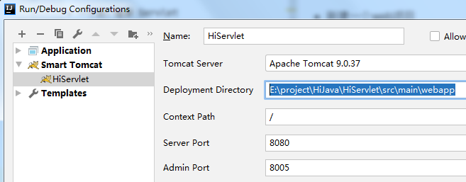
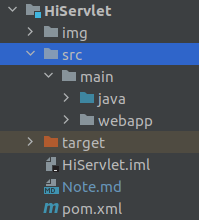
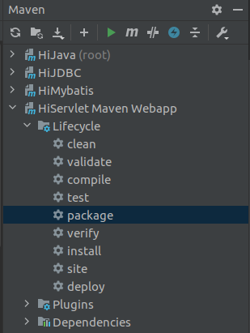
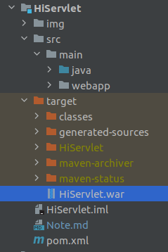

## Tomcat服务器
+ tomcat 目录结构

## IDEA创建web项目

### 新建一个web项目
+ 项目结构
```
webapp
-WEB-INF
--classes
--lib
--web.xml
```
+ 部署在tomcat 中


+ 注意context path 和 部署目录
```
Tomcat Server：tomcat的路径
Deployment：webapp所在的路径
Contex Path：上下文路径。会自己识别出来，一般我们不改这个。
Server Port：默认是8080，可以改成其它
VM options: 可选的。没有参数就不填
```

## HTTP协议

## Servlet概念

### 示例
+ 包
+ 编写
+ 部署
+ 配置

### Servlet接口
```
在ServletAPI中最重要的是Servlet接口，所有Servlet都会直接或间接的与该接口发生联系，或是直接实现该接口，或间接继承自实现了该接口的类。
该接口包括以下五个方法：

init(ServletConfig config)
ServletConfig getServletConfig()
service(ServletRequest req,ServletResponse res)
String getServletInfo()
destroy()

处理方式：

（1）第一次访问Servlet时，服务器会创建Servlet对象，并调用init方法，再调用service方法
（2）第二次再访问时，Servlet对象已经存在，不再创建,也不再初始化，执行service方法
（3）当服务器停止，会释放Servlet，调用destroy方法。
```

### GenericServlet抽象类
```
GenericServlet 使编写 servlet 变得更容易。它提供生命周期方法 init 和 destroy 的简单实现，要编写一般的 servlet，只需重写抽象 service 方法即可。 
```

### HttpServlet类
```
是继承GenericServlet的基础上进一步的扩展。
提供将要被子类化以创建适用于 Web 站点的 HTTP servlet 的抽象类。HttpServlet 的子类至少必须重写一个方法，该方法通常是以下这些方法之一： 
doGet，如果 servlet 支持 HTTP GET 请求 
doPost，用于 HTTP POST 请求 
doPut，用于 HTTP PUT 请求 
doDelete，用于 HTTP DELETE 请求 
init 和 destroy，用于管理 servlet 的生命周期内保存的 资源 
getServletInfo，servlet 使用它提供有关其自身的信息 
```

### 两种配置方式
+ web.xml
+ 注解


## Servlet应用
+ request对象
+ response对象

## 转发和重定向


## Servlet生命周期

## ServletContext 


## 状态管理
### Cookie
### Session

## 过滤器


## Java Web 项目打包

+ 单模块的maven项目


+ 编译

  
+ 查看生成war

