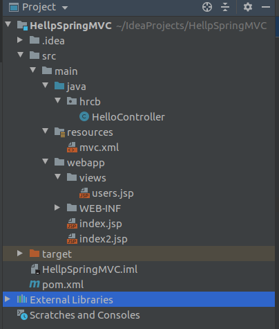

# 1. SpringMVC 简介

- ~~~~~

# 2. SpringMVC 入门
## 创建Maven webapp项目


## ①.导入jar包

```
<dependency>
  <groupId>org.springframework</groupId>
  <artifactId>spring-webmvc</artifactId>
  <version>5.2.6.RELEASE</version>
</dependency>
```

## ②.配置核心前端控制器
作为一个MVC框架，首先要解决的是：如何能够收到请求。

```
  <!-- SpringMVC前端(核心)控制器
       1. 前端，接收所有请求
       2. 启动SpringMVC工厂  mvc.xml
       3. springMVC流程调度
  -->
  <servlet>
    <servlet-name>mvc_shine</servlet-name>
    <servlet-class>org.springframework.web.servlet.DispatcherServlet</servlet-class>
    <init-param>
      <param-name>contextConfigLocation</param-name>
      <param-value>classpath:mvc.xml</param-value>
    </init-param>
    <load-on-startup>1</load-on-startup>
  </servlet>
  <servlet-mapping>
    <servlet-name>mvc_shine</servlet-name>
    <url-pattern>/</url-pattern>
  </servlet-mapping>
```

## ③.后端控制器

```
@Controller
@RequestMapping("/hello")
public class HelloController {

    @RequestMapping("/hello1")
    public String hello1(){
        System.out.println("hello this is hello1 function!!!!");
        return "index2";  //index.jsp
    }

    @RequestMapping("/hello2")
    public String hello2(){
        System.out.println("hello this is hello2 function");
        return "views/users"; // views/user.jsp
    }
}
```

## ④.配置文件
- 随意名称：mvc.xml 位置: resource 
```
<beans 	xmlns="http://www.springframework.org/schema/beans"
          xmlns:context="http://www.springframework.org/schema/context"
          xmlns:mvc="http://www.springframework.org/schema/mvc"
          xmlns:xsi="http://www.w3.org/2001/XMLSchema-instance"
          xsi:schemaLocation="http://www.springframework.org/schema/beans
							http://www.springframework.org/schema/beans/spring-beans.xsd
							http://www.springframework.org/schema/context
							http://www.springframework.org/schema/context/spring-context.xsd
							http://www.springframework.org/schema/mvc
							http://www.springframework.org/schema/mvc/spring-mvc.xsd">

    <!-- 注解扫描 -->
    <context:component-scan base-package="hrcb"/>

    <!-- 注解驱动 -->
    <mvc:annotation-driven></mvc:annotation-driven>

    <!-- 视图解析器
	     作用：1.捕获后端控制器的返回值="hello"
	           2.解析： 在返回值的前后 拼接 ==> "/hello.jsp"
	 -->
    <bean class="org.springframework.web.servlet.view.InternalResourceViewResolver">
        <!-- 前缀 -->
        <property name="prefix" value="/"></property>
        <!-- 后缀 -->
        <property name="suffix" value=".jsp"></property>
    </bean>
</beans>
```

## ⑤.访问
- http://localhost:8080/HellpSpringMVC/hello/hello1

- Tomcat 的配置


# 3 接收请求参数
## 基本类型参数
```
    @RequestMapping("/hello3")
    //请求参数和方法形参同名即可
    //日期默认格式: YYYY/MM/dd HH:mm:ss ,可以通过@DateTimeFormat 进行修改
    public String hello3(Integer id, String name, Boolean gender, @DateTimeFormat(pattern = "yyyy-mm-dd HH:mm:ss") Date birth) {
        //http://localhost:8080/15_springmvc/hello/hello3?id=1&name=%E6%89%93%E7%AE%97&gender=false&birth=2020-07-10%2010:32:32
        System.out.println(id + " " + name + " " + gender + " " + birth);

        return "index";

    }
```

### 实体收参


```
import lombok.AllArgsConstructor;
import lombok.Data;
import lombok.NoArgsConstructor;
import lombok.ToString;
import org.springframework.format.annotation.DateTimeFormat;

import java.util.Date;

@Data
@AllArgsConstructor
@NoArgsConstructor
@ToString
public class User {

    private Integer id;
    private String name;
    private Boolean gender;
    @DateTimeFormat(pattern = "yyyy-mm-dd HH:mm:ss")
    private Date birth;

}

```

```
    @RequestMapping("/hello4")
    //请求参数和实体属性同名即可
    //日期默认格式: YYYY/MM/dd HH:mm:ss ,可以通过@DateTimeFormat 进行修改
    public String hello4(User user) {
        //http://localhost:8080/15_springmvc/hello/hello4?id=1&name=%E6%89%93%E7%AE%97&gender=false&birth=2020-07-10%2010:32:32
        System.out.println(user);

        return "index";
    }
    
    
```
### 数组收参(了解)


### 集合收参(了解)

### 路径收参

```
    @RequestMapping("/hello7/{id}")
    //http://localhost:8080/15_springmvc/hello/hello7/10
    public String hello7(@PathVariable("id") Integer no) {
        System.out.println(no);
        return "index";
    }
```
### 中文乱码
+ 页面中字符集统一
    + JSP: <%@page pageEncoding="utf-8"%>
    + HTML:<meta charset= "UTF-8">
+ TOMCAT
+ + server.xml 
+ 过滤器 (web.xml)
```
  <filter>
    <filter-name>encoding</filter-name>
    <filter-class>org.springframework.web.filter.CharacterEncodingFilter</filter-class>
    <init-param>
      <param-name>encoding</param-name>
      <param-value>utf-8</param-value>
    </init-param>
  </filter>
  <filter-mapping>
    <filter-name>encoding</filter-name>
    <url-pattern>/*</url-pattern>
  </filter-mapping>
```


# 4 跳转

## 转发

## 重定向

## 区别
+ 在增删改之后，为了防止请求重复提交，重定向跳转
+ 在查询之后，可以做转发跳转


# 5 传值


## Request和Session

web的


## 传值


# 6  静态资源


# 7 Json处理


# 8.6


# 8 异常解析器


# 9 l拦截器

# 10 上传 下载 验证码


# 11 REST


```
package hmrcb.controller;

import hmrcb.entity.User;
import org.springframework.web.bind.annotation.*;

import java.util.Arrays;
import java.util.List;

@RestController
@RequestMapping("/rest")
public class RestfulController {

    @GetMapping("/users")
    public List<User> queryAllUsers() {

        List<User> user = Arrays.asList(new User(), new User());
        return user;
    }

    @GetMapping("/users/{id}")
    public String queryOneUser(@PathVariable Integer id) {
        return "{status:2}";
    }


    @PostMapping("/users")
    public String addUser(User user) {
        System.out.println(user);
        return "{status:1}";
    }

    @PutMapping("/users")
    public String updateUser(User user) {
        System.out.println(user);
        return "{status:3}";
    }

    @DeleteMapping("/users/{id}")
    public String deleteUser(@PathVariable Integer id) {
        return "{status:4}";
    }


}

```


